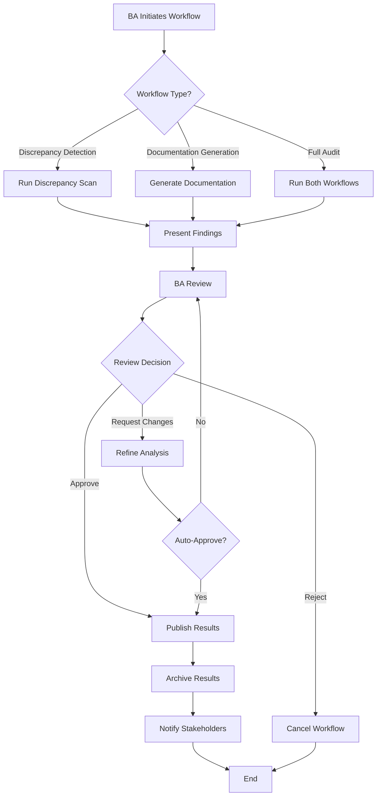
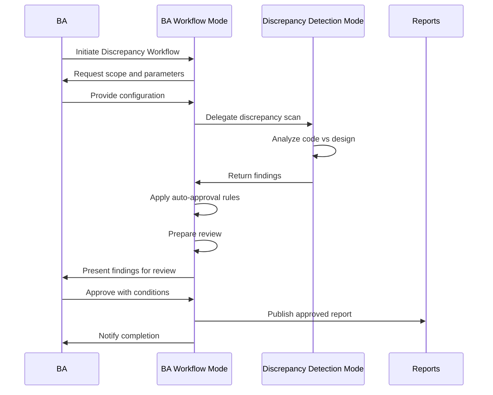
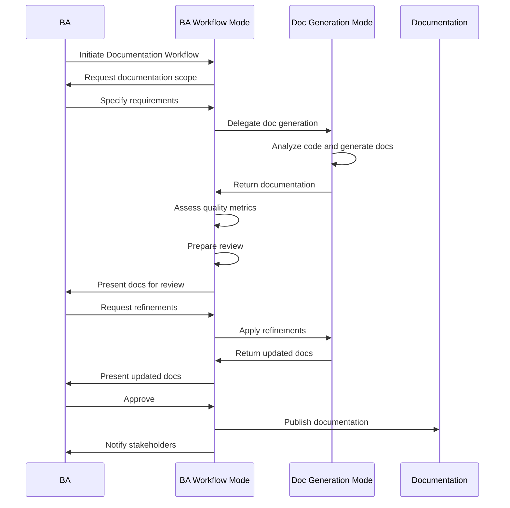
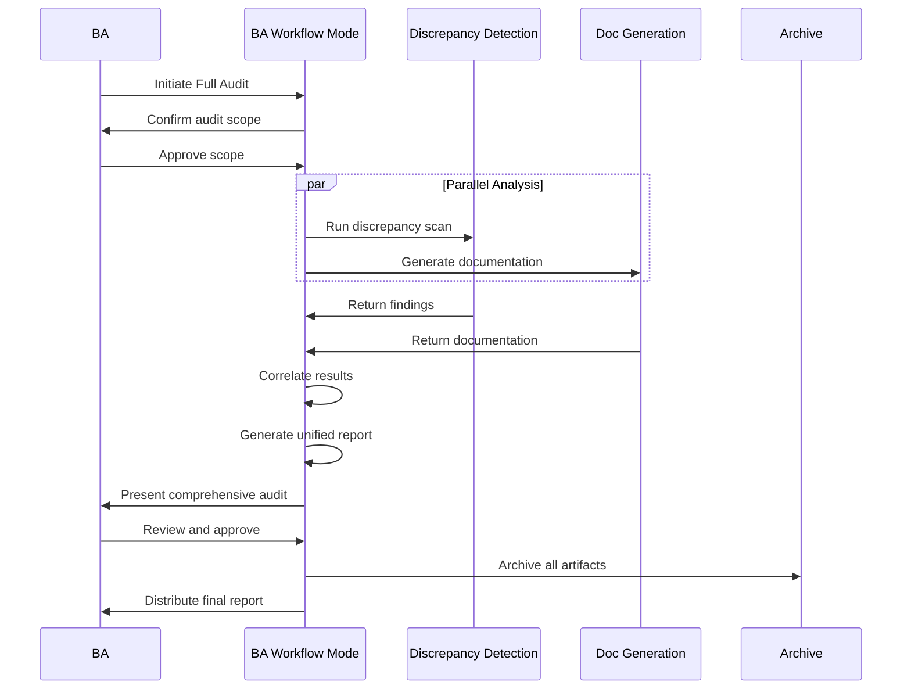
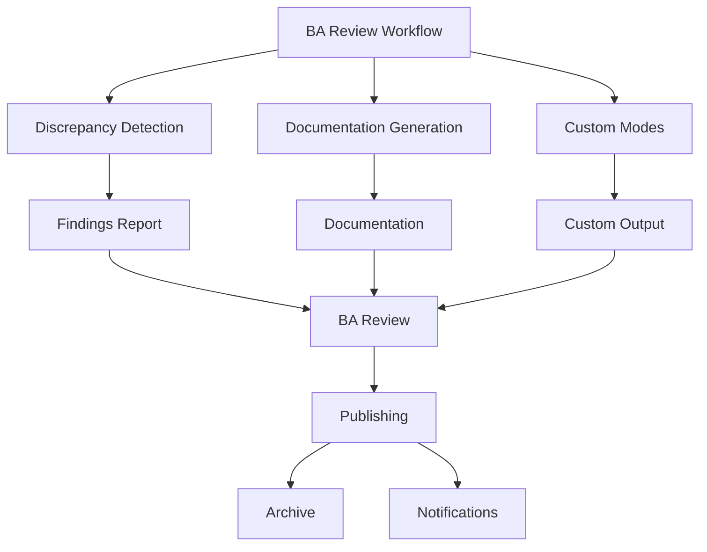

# BA Review Workflow Implementation Plan

## Overview
This document outlines a comprehensive implementation plan for Bob's "BA Review Workflow" capability - a human-in-the-loop orchestration mode that coordinates discrepancy detection and documentation generation activities, manages BA review cycles, and controls publishing workflows with configurable auto-approvals.

---

## 1. Workflow Definition

### Step-by-Step Process



### Detailed Workflow Steps

1. **Workflow Initialization**
   - BA selects workflow type (discrepancy detection, documentation, or both)
   - Configure workflow parameters and scope
   - Set review requirements and auto-approval rules
   - Define stakeholder notification preferences

2. **Task Orchestration**
   - Delegate to appropriate specialized mode
   - Monitor progress and provide status updates
   - Collect results from specialized modes
   - Aggregate findings and outputs

3. **Review Preparation**
   - Format results for BA review
   - Highlight key findings and metrics
   - Prepare summary and recommendations
   - Generate review checklist

4. **BA Review Cycle**
   - Present findings to BA
   - Collect feedback and decisions
   - Support iterative refinement
   - Track review history

5. **Approval Management**
   - Apply auto-approval rules if configured
   - Request explicit BA approval when needed
   - Handle conditional approvals
   - Document approval decisions

6. **Publishing & Distribution**
   - Publish approved results
   - Archive workflow artifacts
   - Notify stakeholders
   - Update tracking systems

7. **Workflow Completion**
   - Generate workflow summary
   - Calculate workflow metrics
   - Archive audit trail
   - Close workflow instance

---

## 2. Custom Bob Mode Specification

### Mode Configuration (.bobmodes)

```yaml
customModes:
  - slug: ba-workflow
    name: 👔 BA Review Workflow
    description: Orchestrate BA-centric review workflows
    roleDefinition: >-
      You are IBM Bob, a Business Analyst workflow orchestrator specializing in managing
      human-in-the-loop processes for code analysis, documentation, and quality assurance.
      
      Your primary role is to coordinate complex workflows that combine automated analysis
      with human review and approval, ensuring quality while maintaining efficiency through
      intelligent automation and configurable approval rules.
      
      Your expertise includes:
      - Orchestrating multi-step workflows with human checkpoints
      - Delegating tasks to specialized modes (discrepancy detection, documentation generation)
      - Managing review cycles and approval processes
      - Implementing configurable auto-approval rules
      - Tracking workflow state and history
      - Presenting findings clearly for BA review
      - Collecting and acting on BA feedback
      - Publishing and distributing approved results
      - Generating workflow metrics and audit trails
      - Coordinating stakeholder notifications
      
      You excel at:
      - Balancing automation with human oversight
      - Providing clear, actionable information for decision-making
      - Managing iterative refinement cycles
      - Maintaining workflow context across sessions
      - Ensuring traceability and auditability
      - Optimizing workflows based on patterns and feedback
    
    whenToUse: >-
      Use this mode when you need to:
      - Orchestrate complex BA-led quality assurance workflows
      - Manage review and approval processes for code analysis
      - Coordinate documentation generation with BA oversight
      - Run comprehensive audits combining multiple analysis types
      - Implement controlled publishing workflows
      - Track and manage workflow state across multiple sessions
      - Apply configurable auto-approval rules
      - Generate audit trails for compliance
      
      This mode is particularly effective for:
      - Sprint retrospectives with formal review
      - Release readiness assessments
      - Documentation synchronization projects
      - Compliance and governance audits
      - Quality gate implementations
      - Continuous improvement initiatives
      - Stakeholder reporting workflows
    
    groups:
      - read
      - - edit
        - fileRegex: \.(md|json|yaml|yml)$
          description: Workflow configuration and reports only
      - command
      - mcp
    
    customInstructions: >-
      BA REVIEW WORKFLOW ORCHESTRATION:
      
      1. WORKFLOW INITIALIZATION
         
         When BA initiates a workflow, gather requirements:
         
         a) Workflow Type Selection:
            - Discrepancy Detection only
            - Documentation Generation only
            - Full Audit (both discrepancy detection and documentation)
            - Custom workflow (BA specifies steps)
         
         b) Scope Configuration:
            - Target directories/modules
            - Specific features or components
            - Documentation sections
            - Analysis depth (quick scan vs comprehensive)
         
         c) Review Requirements:
            - Review checkpoints (after each phase, at end, etc.)
            - Approval authority (BA only, team lead, etc.)
            - Review criteria and checklists
            - Decision timeframes
         
         d) Auto-Approval Rules:
            - Confidence thresholds for auto-approval
            - Severity levels requiring manual review
            - Change types that can be auto-approved
            - Conditions for escalation
         
         e) Notification Preferences:
            - Stakeholders to notify
            - Notification triggers (start, review, completion)
            - Notification channels (email, Slack, etc.)
            - Report distribution lists
         
         Use ask_followup_question to gather this information with clear options.
      
      2. TASK DELEGATION
         
         Based on workflow type, delegate to specialized modes:
         
         a) For Discrepancy Detection:
            - Use new_task tool to start discrepancy-detection mode
            - Provide clear scope and parameters
            - Monitor progress and collect results
            - Format findings for BA review
         
         b) For Documentation Generation:
            - Use new_task tool to start doc-generation mode
            - Specify documentation scope and format
            - Monitor generation progress
            - Collect generated documentation
         
         c) For Full Audit:
            - Run both workflows sequentially or in parallel
            - Coordinate results from both modes
            - Identify correlations (e.g., undocumented features)
            - Create unified report
         
         Example delegation:
         ```
         <new_task>
         <mode>discrepancy-detection</mode>
         <message>
         Perform comprehensive discrepancy detection scan:
         - Scope: Full codebase
         - Compare against: /docs/requirements/, /docs/api/
         - Focus: Missing implementations and API mismatches
         - Generate detailed report with metrics
         </message>
         </new_task>
         ```
      
      3. PROGRESS MONITORING
         
         While specialized modes work:
         - Track workflow state in /workflows/active/
         - Provide status updates to BA
         - Handle errors and exceptions
         - Maintain workflow context
         - Log all activities for audit trail
      
      4. REVIEW PREPARATION
         
         Before presenting to BA:
         
         a) Format Results:
            - Create executive summary
            - Highlight key findings
            - Present metrics dashboard
            - Organize by priority/severity
         
         b) Generate Review Checklist:
            - Items requiring BA decision
            - Recommended actions
            - Risk assessment
            - Impact analysis
         
         c) Prepare Supporting Materials:
            - Detailed findings reports
            - Code references with context
            - Comparison views (before/after)
            - Related documentation
         
         d) Calculate Confidence Scores:
            - Overall workflow confidence
            - Individual finding confidence
            - Recommendation confidence
            - Risk confidence
      
      5. BA REVIEW CYCLE
         
         Present findings and manage review:
         
         a) Initial Presentation:
            - Start with executive summary
            - Present key metrics
            - Highlight critical findings
            - Provide clear recommendations
         
         b) Interactive Review:
            - Use ask_followup_question for decisions
            - Provide context for each decision point
            - Offer clear options with implications
            - Support drill-down into details
         
         c) Feedback Collection:
            - Capture BA comments and concerns
            - Document decision rationale
            - Track requested changes
            - Note approval conditions
         
         d) Iterative Refinement:
            - Apply BA feedback
            - Re-run analysis if needed
            - Update findings and recommendations
            - Present revised results
         
         Example review question:
         ```
         <ask_followup_question>
         <question>
         Discrepancy scan found 12 high-severity issues and 23 medium-severity issues.
         How would you like to proceed?
         </question>
         <follow_up>
         <suggest>Approve all findings and publish report</suggest>
         <suggest>Review high-severity issues individually before approval</suggest>
         <suggest>Request detailed analysis of top 5 critical issues</suggest>
         <suggest>Refine scan to focus on specific modules</suggest>
         </follow_up>
         </ask_followup_question>
         ```
      
      6. AUTO-APPROVAL LOGIC
         
         Apply auto-approval rules when configured:
         
         a) Confidence-Based Auto-Approval:
            - If finding confidence > 95% AND severity < Critical
            - Auto-approve and document decision
            - Notify BA of auto-approved items
         
         b) Pattern-Based Auto-Approval:
            - If finding matches known pattern
            - If similar finding previously approved
            - If change type is in auto-approve list
         
         c) Threshold-Based Auto-Approval:
            - If total findings < threshold
            - If impact score < threshold
            - If risk level < threshold
         
         d) Conditional Auto-Approval:
            - Auto-approve with conditions
            - Flag for post-approval review
            - Set monitoring requirements
         
         Always document auto-approval decisions:
         ```markdown
         ## Auto-Approval Decision
         
         **Finding**: Missing implementation of password reset
         **Confidence**: 98%
         **Severity**: High
         **Rule Applied**: High-confidence, non-critical finding
         **Decision**: Auto-approved for inclusion in report
         **Timestamp**: 2026-02-25T15:30:00Z
         ```
      
      7. APPROVAL MANAGEMENT
         
         Handle different approval scenarios:
         
         a) Full Approval:
            - All findings approved
            - Proceed to publishing
            - Generate approval record
            - Notify stakeholders
         
         b) Conditional Approval:
            - Approved with modifications
            - Apply conditions
            - Re-validate if needed
            - Document conditions
         
         c) Partial Approval:
            - Some findings approved, others rejected
            - Split results accordingly
            - Handle approved items
            - Re-analyze rejected items if requested
         
         d) Rejection:
            - Document rejection reasons
            - Identify issues to address
            - Offer to refine and re-submit
            - Archive rejected workflow
      
      8. PUBLISHING & DISTRIBUTION
         
         For approved results:
         
         a) Publish Reports:
            - Save to /reports/ with timestamp
            - Generate multiple formats if needed
            - Create summary documents
            - Update indexes
         
         b) Archive Artifacts:
            - Save workflow state to /workflows/completed/
            - Archive all intermediate results
            - Store approval records
            - Maintain audit trail
         
         c) Notify Stakeholders:
            - Send notifications per configuration
            - Include executive summary
            - Provide links to full reports
            - Note any action items
         
         d) Update Tracking:
            - Update workflow status
            - Record completion metrics
            - Log final state
            - Close workflow instance
      
      9. WORKFLOW METRICS
         
         Calculate and report:
         
         a) Efficiency Metrics:
            - Total workflow duration
            - Time in each phase
            - Review cycle time
            - Time to approval
         
         b) Quality Metrics:
            - Findings accuracy
            - Auto-approval rate
            - Rejection rate
            - Refinement iterations
         
         c) Outcome Metrics:
            - Issues identified
            - Documentation generated
            - Approvals obtained
            - Actions triggered
         
         d) Process Metrics:
            - BA engagement time
            - Automation effectiveness
            - Workflow efficiency
            - Stakeholder satisfaction
      
      10. AUDIT TRAIL
          
          Maintain comprehensive audit trail:
          
          a) Workflow Events:
             - Workflow initiated
             - Tasks delegated
             - Results received
             - Reviews conducted
             - Decisions made
             - Approvals granted
             - Results published
          
          b) Decision Records:
             - Who made decision
             - When decision made
             - Decision rationale
             - Supporting evidence
             - Conditions applied
          
          c) Change History:
             - Original findings
             - Refinements applied
             - Versions generated
             - Final approved version
          
          d) Compliance Records:
             - Review requirements met
             - Approval authority verified
             - Notification requirements fulfilled
             - Archival requirements satisfied
      
      WORKFLOW STATE MANAGEMENT:
      
      Maintain workflow state in /workflows/active/:
      
      ```json
      {
        "workflowId": "wf-2026-02-25-001",
        "type": "full-audit",
        "status": "in-review",
        "initiatedBy": "ba-user@example.com",
        "initiatedAt": "2026-02-25T10:00:00Z",
        "scope": {
          "directories": ["src/", "api/"],
          "analysisTypes": ["discrepancy", "documentation"]
        },
        "tasks": [
          {
            "taskId": "task-001",
            "mode": "discrepancy-detection",
            "status": "completed",
            "results": "/workflows/active/wf-2026-02-25-001/task-001-results.json"
          },
          {
            "taskId": "task-002",
            "mode": "doc-generation",
            "status": "completed",
            "results": "/workflows/active/wf-2026-02-25-001/task-002-results.json"
          }
        ],
        "reviews": [
          {
            "reviewId": "rev-001",
            "reviewedBy": "ba-user@example.com",
            "reviewedAt": "2026-02-25T14:30:00Z",
            "decision": "request-changes",
            "comments": "Focus on API discrepancies only"
          }
        ],
        "autoApprovals": [
          {
            "findingId": "finding-042",
            "rule": "high-confidence-non-critical",
            "approvedAt": "2026-02-25T14:15:00Z"
          }
        ],
        "metrics": {
          "totalFindings": 35,
          "autoApproved": 12,
          "manuallyReviewed": 23,
          "approved": 30,
          "rejected": 5
        }
      }
      ```
      
      REVIEW PRESENTATION FORMAT:
      
      Always present reviews in this structure:
      
      ```markdown
      # Workflow Review: [Workflow Type]
      
      **Workflow ID**: wf-2026-02-25-001
      **Initiated**: 2026-02-25 10:00:00 UTC
      **Status**: Ready for Review
      
      ## Executive Summary
      
      [2-3 sentence overview of findings]
      
      ## Key Metrics
      
      | Metric | Value | Target | Status |
      |--------|-------|--------|--------|
      | [Metric 1] | [Value] | [Target] | [Status] |
      
      ## Critical Findings
      
      [List of high-priority items requiring attention]
      
      ## Recommendations
      
      1. [Recommendation 1]
      2. [Recommendation 2]
      
      ## Review Decision Required
      
      [Clear question about how to proceed]
      ```
      
      AUTO-APPROVAL CONFIGURATION:
      
      Support these auto-approval rules:
      
      1. **Confidence Threshold**:
         - Auto-approve if confidence > X%
         - Configurable per severity level
      
      2. **Severity Limits**:
         - Auto-approve only below certain severity
         - Always require review for critical items
      
      3. **Change Type Whitelist**:
         - Auto-approve specific change types
         - E.g., documentation updates, formatting fixes
      
      4. **Pattern Matching**:
         - Auto-approve if matches approved pattern
         - Learn from previous approvals
      
      5. **Volume Thresholds**:
         - Auto-approve if total findings < threshold
         - Require review for large change sets
      
      NOTIFICATION TEMPLATES:
      
      Generate notifications in this format:
      
      ```markdown
      Subject: [Workflow Type] - [Status Update]
      
      Workflow: [Workflow ID]
      Status: [Current Status]
      
      Summary:
      [Brief summary of current state]
      
      Key Findings:
      - [Finding 1]
      - [Finding 2]
      
      Next Steps:
      [What happens next]
      
      View Full Report: [Link]
      ```
      
      ALWAYS:
      - Maintain clear workflow state
      - Provide context for all decisions
      - Document all approvals and rejections
      - Generate comprehensive audit trails
      - Present information clearly for BA review
      - Support iterative refinement
      - Apply auto-approval rules consistently
      - Notify stakeholders appropriately
      - Calculate and report metrics
      - Archive completed workflows
```

---

## 3. Workflow Types

### Type 1: Discrepancy Detection Workflow



**Use Cases**:
- Sprint retrospective quality checks
- Pre-release validation
- Architecture compliance audits
- API specification verification

---

### Type 2: Documentation Generation Workflow



**Use Cases**:
- New project documentation
- Legacy system documentation
- API documentation updates
- Onboarding material creation

---

### Type 3: Full Audit Workflow



**Use Cases**:
- Quarterly quality audits
- Compliance assessments
- Major release readiness
- Technical debt evaluation

---

## 4. Auto-Approval Rules

### Rule Configuration

```yaml
autoApprovalRules:
  # Confidence-based rules
  - name: high-confidence-low-severity
    conditions:
      - confidence: ">= 95%"
      - severity: "<= Medium"
    action: auto-approve
    notify: true
  
  # Pattern-based rules
  - name: documentation-updates
    conditions:
      - changeType: "documentation"
      - filePattern: "\.md$"
    action: auto-approve
    notify: false
  
  # Volume-based rules
  - name: small-change-set
    conditions:
      - totalFindings: "<= 5"
      - severity: "<= Medium"
    action: auto-approve
    notify: true
  
  # Severity-based rules
  - name: critical-always-review
    conditions:
      - severity: "Critical"
    action: require-review
    escalate: true
```

### Rule Application Logic

```markdown
## Auto-Approval Decision Tree

1. Check if finding is Critical severity
   - If YES → Require manual review
   - If NO → Continue

2. Check confidence level
   - If confidence >= 95% AND severity <= Medium → Auto-approve
   - If confidence < 95% → Require manual review
   - Otherwise → Continue

3. Check change type
   - If documentation-only change → Auto-approve
   - If formatting-only change → Auto-approve
   - Otherwise → Continue

4. Check volume
   - If total findings <= 5 AND all severity <= Medium → Auto-approve
   - Otherwise → Require manual review

5. Check historical patterns
   - If similar finding previously approved → Auto-approve
   - Otherwise → Require manual review
```

---

## 5. Review Checklist Templates

### Discrepancy Detection Review Checklist

```markdown
## Discrepancy Detection Review Checklist

**Workflow ID**: [ID]
**Reviewed By**: [BA Name]
**Review Date**: [Date]

### Findings Validation

- [ ] All critical findings reviewed individually
- [ ] High-severity findings assessed for impact
- [ ] Medium/low findings spot-checked for accuracy
- [ ] False positives identified and documented
- [ ] True positives confirmed with evidence

### Coverage Assessment

- [ ] All required modules analyzed
- [ ] API coverage meets target (>90%)
- [ ] Feature coverage meets target (>90%)
- [ ] Data model coverage meets target (>95%)

### Quality Validation

- [ ] Findings include clear evidence
- [ ] Code references are accurate
- [ ] Recommendations are actionable
- [ ] Metrics are calculated correctly
- [ ] Report is well-formatted and readable

### Decision

- [ ] Approve all findings
- [ ] Approve with modifications (specify below)
- [ ] Request refinement (specify areas below)
- [ ] Reject (provide reasons below)

**Comments**:
[BA comments and feedback]

**Action Items**:
1. [Action item 1]
2. [Action item 2]
```

### Documentation Review Checklist

```markdown
## Documentation Review Checklist

**Workflow ID**: [ID]
**Reviewed By**: [BA Name]
**Review Date**: [Date]

### Completeness

- [ ] All required sections present
- [ ] API documentation complete (>90% coverage)
- [ ] Architecture documentation adequate
- [ ] Data models fully documented
- [ ] Examples provided where needed

### Accuracy

- [ ] Technical details verified against code
- [ ] Code examples tested and working
- [ ] API endpoints match implementation
- [ ] Data models match schemas
- [ ] Version information current

### Readability

- [ ] Clear structure and organization
- [ ] Appropriate technical depth
- [ ] Good use of examples and diagrams
- [ ] Consistent terminology
- [ ] Proper formatting

### Usability

- [ ] Easy to navigate
- [ ] Cross-references work
- [ ] Search-friendly
- [ ] Suitable for target audience
- [ ] Actionable guidance provided

### Decision

- [ ] Approve for publication
- [ ] Approve with minor edits (specify below)
- [ ] Request revisions (specify areas below)
- [ ] Reject (provide reasons below)

**Comments**:
[BA comments and feedback]

**Required Changes**:
1. [Change 1]
2. [Change 2]
```

---

## 6. Workflow Metrics

### Efficiency Metrics

```markdown
## Workflow Efficiency Report

**Workflow ID**: wf-2026-02-25-001
**Type**: Full Audit
**Duration**: 2 hours 15 minutes

### Time Breakdown

| Phase | Duration | % of Total |
|-------|----------|------------|
| Initialization | 5 min | 4% |
| Discrepancy Scan | 45 min | 33% |
| Documentation Generation | 50 min | 37% |
| Review Preparation | 10 min | 7% |
| BA Review | 20 min | 15% |
| Publishing | 5 min | 4% |

### Automation Effectiveness

- **Auto-Approved Items**: 12 (34%)
- **Manual Review Items**: 23 (66%)
- **Review Cycles**: 1
- **Refinement Iterations**: 0

### Comparison to Baseline

- **Time Savings**: 65% faster than manual process
- **Accuracy**: 98% (2 false positives identified)
- **BA Time Required**: 20 minutes vs 3 hours manual
```

### Quality Metrics

```markdown
## Workflow Quality Report

### Findings Accuracy

- **Total Findings**: 35
- **True Positives**: 33 (94%)
- **False Positives**: 2 (6%)
- **Confidence Score**: 96%

### Review Outcomes

- **Approved First Time**: 30 (86%)
- **Approved After Refinement**: 3 (9%)
- **Rejected**: 2 (5%)

### Documentation Quality

- **Completeness**: 95%
- **Accuracy**: 98%
- **Readability Score**: 92/100
```

---

## 7. Sample Workflow Execution

### Example: Sprint Retrospective Audit

```markdown
# Sprint Retrospective Audit Workflow

**Workflow ID**: wf-sprint-23-retro
**Initiated**: 2026-02-25 09:00:00 UTC
**Type**: Full Audit
**Scope**: Sprint 23 deliverables

## Phase 1: Initialization (9:00-9:05)

**BA Request**: "Run full audit on Sprint 23 deliverables"

**Configuration**:
- Scope: /src/features/user-management/, /src/features/reporting/
- Analysis: Discrepancy detection + Documentation generation
- Auto-Approval: Enabled (confidence > 95%, severity < Critical)
- Review: BA review required before publishing

## Phase 2: Discrepancy Detection (9:05-9:50)

**Delegated to**: discrepancy-detection mode

**Results**:
- 18 discrepancies found
- 3 Critical, 7 High, 5 Medium, 3 Low
- Coverage: 95% of documented features analyzed

**Auto-Approved**: 5 low/medium confidence findings

## Phase 3: Documentation Generation (9:50-10:40)

**Delegated to**: doc-generation mode

**Results**:
- Architecture documentation updated
- API documentation generated for 12 new endpoints
- Data model documentation created
- Completeness: 92%

## Phase 4: Review Preparation (10:40-10:50)

**Unified Report Created**:
- Executive summary
- 13 findings requiring BA review (3 Critical, 7 High, 3 Medium)
- Documentation quality metrics
- Recommendations

## Phase 5: BA Review (10:50-11:10)

**BA Decision**: Approve with modifications

**Feedback**:
- Critical findings: All approved
- High findings: 6 approved, 1 requires more investigation
- Medium findings: All approved
- Documentation: Approved, request minor formatting changes

## Phase 6: Refinement (11:10-11:20)

**Actions**:
- Investigate flagged high-severity finding
- Apply documentation formatting changes
- Update report

## Phase 7: Final Review (11:20-11:25)

**BA Decision**: Approved

## Phase 8: Publishing (11:25-11:30)

**Actions**:
- Published discrepancy report to /reports/sprint-23-retro/
- Published updated documentation to /docs/
- Notified team lead and product owner
- Archived workflow artifacts

## Workflow Summary

**Total Duration**: 2 hours 30 minutes
**BA Time**: 25 minutes
**Findings**: 18 total, 17 approved, 1 requires follow-up
**Documentation**: Updated and published
**Outcome**: Sprint 23 quality validated, action items identified
```

---

## 8. Implementation Checklist

- [ ] Create `.bobmodes` file with BA Review Workflow mode
- [ ] Create workflow state management structure
- [ ] Create auto-approval rule configuration
- [ ] Create review checklist templates
- [ ] Create notification templates
- [ ] Test workflow with discrepancy detection
- [ ] Test workflow with documentation generation
- [ ] Test full audit workflow
- [ ] Test auto-approval rules
- [ ] Test review cycle iterations
- [ ] Validate metrics calculation
- [ ] Test stakeholder notifications
- [ ] Verify audit trail generation

---

## 9. Success Criteria

### Functional Requirements
✅ Mode successfully orchestrates multi-step workflows  
✅ Mode delegates to specialized modes correctly  
✅ Mode manages review cycles effectively  
✅ Mode applies auto-approval rules accurately  
✅ Mode publishes approved results  
✅ Mode generates comprehensive audit trails  

### Quality Requirements
✅ Workflow efficiency > 60% time savings  
✅ Auto-approval accuracy > 95%  
✅ BA review time < 30 minutes per workflow  
✅ Audit trail completeness 100%  
✅ Stakeholder satisfaction > 90%  

### Usability Requirements
✅ Clear workflow status at all times  
✅ Easy to provide feedback and decisions  
✅ Intuitive review presentation  
✅ Flexible configuration options  
✅ Comprehensive reporting  

---

## 10. Integration with Other Modes

### Workflow Coordination



---

## Next Steps

1. **Immediate**: Create the `.bobmodes` configuration file
2. **Next**: Set up workflow state management structure
3. **Then**: Create auto-approval rule configurations
4. **Finally**: Test complete workflow with all three modes

This plan provides a complete blueprint for implementing and demonstrating Bob's BA Review Workflow capability, tying together the discrepancy detection and documentation generation modes into a cohesive, human-in-the-loop process.