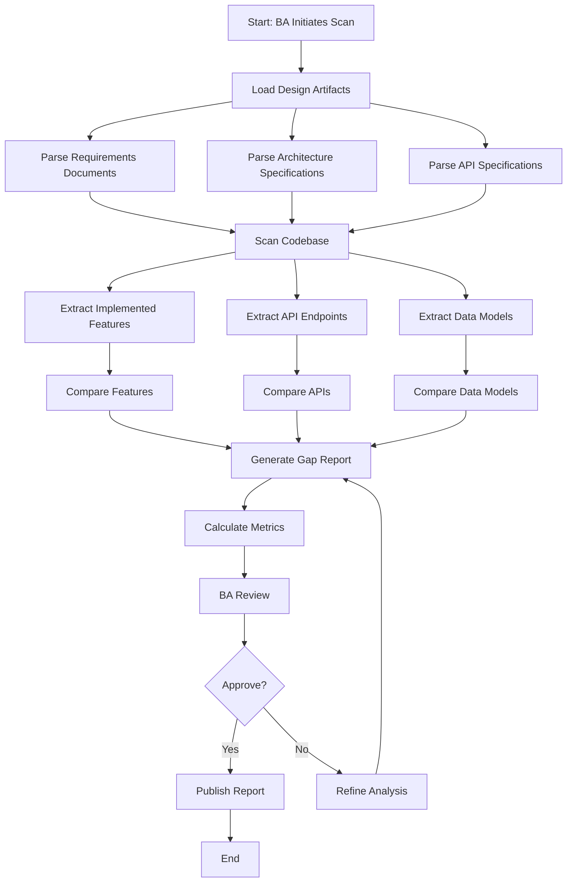
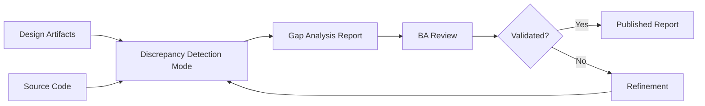
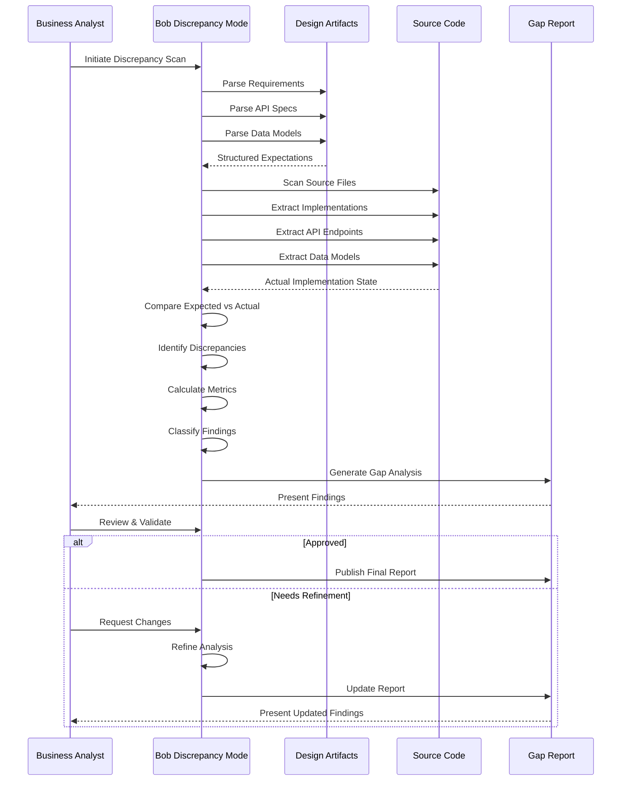
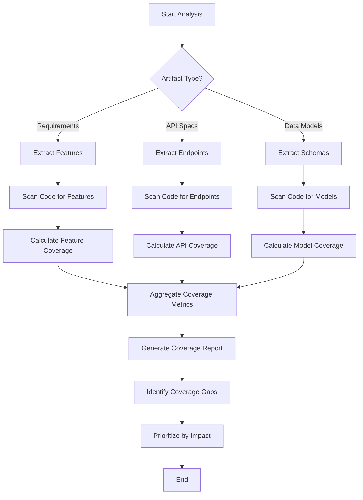

# Discrepancy Detection Implementation Plan

## Overview
This document outlines a comprehensive implementation plan for Bob's "Discrepancy Detection" capability - a BA-centric workflow that automatically identifies gaps and inconsistencies between design artifacts and actual code implementation.

---

## 1. Workflow Definition

### Step-by-Step Process



### Detailed Workflow Steps

1. **Initialization Phase**
   - BA triggers discrepancy detection scan
   - Mode identifies design artifact locations
   - Validates artifact accessibility and format

2. **Artifact Parsing Phase**
   - Parse requirements documents (Markdown, Word, PDF)
   - Extract feature lists, user stories, acceptance criteria
   - Parse architecture diagrams and descriptions
   - Extract API specifications (OpenAPI, Swagger, custom docs)
   - Identify data models and schemas

3. **Code Analysis Phase**
   - Scan source code directories
   - Extract implemented features from code
   - Identify API endpoints and routes
   - Parse data models and database schemas
   - Map code to design artifacts

4. **Comparison Phase**
   - Match documented features to implementations
   - Compare API specifications to actual endpoints
   - Validate data models against schemas
   - Identify architecture violations
   - Detect undocumented implementations

5. **Gap Identification Phase**
   - Classify discrepancies by type and severity
   - Calculate coverage metrics
   - Identify true positives vs false positives
   - Generate time-to-first-report metrics
   - Prioritize findings

6. **Reporting Phase**
   - Generate structured gap analysis report
   - Include metrics and statistics
   - Provide actionable recommendations
   - Present findings for BA review

7. **Review & Publishing Phase**
   - BA reviews findings
   - Validates true vs false positives
   - Approves or requests refinement
   - Publishes final report

---

## 2. Custom Bob Mode Specification

### Mode Configuration (.bobmodes)

```yaml
customModes:
  - slug: discrepancy-detection
    name: 🔍 Discrepancy Detection
    description: Detect gaps between design and code
    roleDefinition: >-
      You are IBM Bob, a Business Analyst assistant specializing in discrepancy detection and gap analysis.
      Your primary role is to identify inconsistencies between design artifacts (requirements documents, 
      architecture specifications, API documentation) and actual code implementation.
      
      Your expertise includes:
      - Parsing and analyzing requirements documents, user stories, and acceptance criteria
      - Understanding architecture diagrams and technical specifications
      - Analyzing API documentation (OpenAPI, Swagger, REST/GraphQL specs)
      - Scanning codebases to extract implemented features, endpoints, and data models
      - Performing systematic comparisons between documented and implemented functionality
      - Identifying missing implementations, undocumented features, and specification mismatches
      - Calculating coverage metrics and quality indicators
      - Distinguishing true positives from false positives in gap analysis
      - Generating clear, actionable discrepancy reports for BA review
      
      You follow a structured, methodical approach to ensure comprehensive coverage and accurate results.
    
    whenToUse: >-
      Use this mode when you need to:
      - Verify that code implementation matches design specifications
      - Identify gaps between requirements and actual implementation
      - Detect undocumented features or technical debt
      - Validate API implementations against specifications
      - Ensure data models match documented schemas
      - Perform architecture compliance checks
      - Generate gap analysis reports for stakeholder review
      - Support BA-led quality assurance processes
      
      This mode is particularly effective for:
      - Sprint retrospectives and quality audits
      - Pre-release validation checks
      - Documentation synchronization efforts
      - Technical debt identification
      - Compliance and governance reviews
    
    groups:
      - read
      - - edit
        - fileRegex: \.(md|txt|json|yaml|yml)$
          description: Documentation and configuration files only
      - command
      - mcp
    
    customInstructions: >-
      DISCREPANCY DETECTION WORKFLOW:
      
      1. ARTIFACT DISCOVERY
         - Locate design artifacts in standard locations:
           * /docs/requirements/ - Requirements documents
           * /docs/architecture/ - Architecture specifications
           * /docs/api/ - API documentation
           * /docs/design/ - Design documents
         - Use search_files to find relevant documents
         - Validate artifact formats and accessibility
      
      2. ARTIFACT PARSING
         - Extract structured information from design documents:
           * Feature lists and user stories
           * API endpoints and methods
           * Data models and schemas
           * Architecture components and relationships
         - Create internal representation of "expected" state
      
      3. CODE ANALYSIS
         - Scan source code directories systematically:
           * /src/ - Main source code
           * /api/ or /routes/ - API implementations
           * /models/ or /entities/ - Data models
           * /services/ - Business logic
         - Use list_code_definition_names to extract code structure
         - Use search_files to find specific implementations
         - Create internal representation of "actual" state
      
      4. COMPARISON & GAP IDENTIFICATION
         - Compare expected vs actual state across dimensions:
           * Features: Documented but not implemented
           * Features: Implemented but not documented
           * APIs: Endpoint mismatches (path, method, parameters)
           * Data Models: Schema inconsistencies
           * Architecture: Component violations
         - Classify each discrepancy:
           * Type: Missing, Extra, Mismatch, Violation
           * Severity: Critical, High, Medium, Low
           * Confidence: High, Medium, Low (for false positive detection)
      
      5. METRICS CALCULATION
         - Coverage Metrics:
           * Feature Coverage: (Implemented Features / Total Documented Features) × 100%
           * API Coverage: (Matching Endpoints / Total Documented Endpoints) × 100%
           * Module Coverage: (Analyzed Modules / Total Modules) × 100%
         - Quality Metrics:
           * True Positive Rate: Estimated based on confidence levels
           * False Positive Rate: Estimated based on ambiguous matches
           * Time to First Report: Track analysis duration
         - Discrepancy Metrics:
           * Total Discrepancies Found
           * Discrepancies by Type
           * Discrepancies by Severity
      
      6. REPORT GENERATION
         - Create structured markdown report with sections:
           * Executive Summary
           * Coverage Analysis
           * Discrepancy Details (grouped by type)
           * Metrics Dashboard
           * Recommendations
         - Use tables for structured data
         - Include code references with file paths and line numbers
         - Provide actionable next steps
      
      7. BA REVIEW WORKFLOW
         - Present findings clearly and concisely
         - Use ask_followup_question to request BA validation
         - Offer options to:
           * Approve and publish report
           * Refine analysis (specify areas)
           * Investigate specific discrepancies
           * Re-run with different parameters
         - Iterate based on BA feedback
      
      OUTPUT FORMAT REQUIREMENTS:
      
      - All reports must be in Markdown format
      - Save reports to /reports/discrepancy-detection/
      - Use ISO 8601 timestamps in filenames
      - Include metadata section with:
        * Analysis date and time
        * Artifacts analyzed
        * Code directories scanned
        * Analysis parameters
      
      DISCREPANCY TYPES TO DETECT:
      
      1. Missing Implementations
         - Features documented but not found in code
         - API endpoints specified but not implemented
         - Data fields defined but not in models
      
      2. Undocumented Features
         - Code functionality not in requirements
         - API endpoints not in specifications
         - Data fields not in schema documentation
      
      3. Specification Mismatches
         - API method differences (GET vs POST)
         - Parameter type mismatches
         - Response format differences
         - Authentication/authorization discrepancies
      
      4. Data Model Inconsistencies
         - Field name differences
         - Data type mismatches
         - Required vs optional field differences
         - Relationship mismatches
      
      5. Architecture Violations
         - Components in wrong layers
         - Dependency violations
         - Pattern violations
         - Security requirement violations
      
      FALSE POSITIVE MITIGATION:
      
      - Use fuzzy matching for names (handle camelCase, snake_case, etc.)
      - Consider synonyms and common variations
      - Account for implementation details vs specifications
      - Flag low-confidence matches for BA review
      - Provide context for each finding
      
      PERFORMANCE CONSIDERATIONS:
      
      - Process large codebases incrementally
      - Cache parsed artifacts for re-analysis
      - Provide progress updates for long-running scans
      - Allow selective analysis (specific modules/features)
      
      ALWAYS:
      - Be thorough but efficient
      - Provide clear evidence for each discrepancy
      - Include file paths and line numbers
      - Calculate and report metrics
      - Request BA validation before finalizing
      - Generate actionable recommendations
```

---

## 3. Sample Project Structure

### Directory Layout

```
/Nationwide Demo/
├── .bobmodes                          # Bob mode configurations
├── docs/                              # Design artifacts
│   ├── requirements/
│   │   ├── user-stories.md           # User stories and acceptance criteria
│   │   ├── feature-list.md           # Complete feature list
│   │   └── business-requirements.md  # High-level business requirements
│   ├── architecture/
│   │   ├── system-architecture.md    # System architecture description
│   │   ├── component-diagram.md      # Component relationships
│   │   └── data-flow.md              # Data flow documentation
│   ├── api/
│   │   ├── api-specification.yaml    # OpenAPI/Swagger spec
│   │   ├── endpoints.md              # API endpoint documentation
│   │   └── authentication.md         # Auth requirements
│   └── design/
│       ├── data-models.md            # Data model specifications
│       └── database-schema.md        # Database schema documentation
├── src/                               # Source code
│   ├── api/
│   │   ├── routes/
│   │   │   ├── users.js              # User endpoints (with gaps)
│   │   │   ├── products.js           # Product endpoints (complete)
│   │   │   └── orders.js             # Order endpoints (extra features)
│   │   └── middleware/
│   │       └── auth.js               # Authentication middleware
│   ├── models/
│   │   ├── User.js                   # User model (field mismatch)
│   │   ├── Product.js                # Product model (complete)
│   │   └── Order.js                  # Order model (missing fields)
│   ├── services/
│   │   ├── userService.js            # User business logic
│   │   ├── productService.js         # Product business logic
│   │   └── orderService.js           # Order business logic (undocumented)
│   └── utils/
│       └── validation.js             # Validation utilities
├── reports/                           # Generated reports
│   └── discrepancy-detection/
│       └── .gitkeep
└── reference/                         # Reference materials for Bob
    ├── discrepancy-examples.md       # Example discrepancies
    └── analysis-guidelines.md        # Analysis best practices
```

### Intentional Discrepancies for Testing

1. **Missing Implementations**
   - User password reset endpoint (documented but not implemented)
   - Product inventory tracking (in requirements but missing)
   - Order cancellation feature (specified but absent)

2. **Undocumented Features**
   - Order status webhook (implemented but not in API docs)
   - User profile image upload (code exists, not in requirements)
   - Product recommendation engine (implemented, not documented)

3. **API Mismatches**
   - User creation endpoint: Documented as POST /api/users, implemented as POST /api/v1/users
   - Product search: Documented as GET with query params, implemented as POST with body
   - Order update: Documented as PUT, implemented as PATCH

4. **Data Model Inconsistencies**
   - User model: Email field documented as required, implemented as optional
   - Product model: Price documented as decimal, implemented as integer
   - Order model: Missing "deliveryDate" field from specification

5. **Architecture Violations**
   - Direct database access in route handlers (should use services)
   - Business logic in models (should be in services)
   - Missing authentication on admin endpoints

---

## 4. Workflow Diagrams

### High-Level Process Flow



### Detailed Analysis Process



### Coverage Analysis Flow



---

## 5. Concrete Discrepancy Examples

### Example 1: Missing Implementation

**Design Artifact** (docs/api/endpoints.md):
```markdown
### POST /api/users/reset-password
Reset user password via email token

**Request Body:**
- email (string, required): User email address
- token (string, required): Password reset token
- newPassword (string, required): New password

**Response:**
- 200: Password reset successful
- 400: Invalid token or password
- 404: User not found
```

**Code Analysis** (src/api/routes/users.js):
```javascript
// No implementation found for password reset endpoint
// Expected: router.post('/reset-password', ...)
// Actual: Missing
```

**Discrepancy Report Entry:**
```markdown
#### Missing Implementation: Password Reset Endpoint

**Type:** Missing Implementation  
**Severity:** High  
**Confidence:** High  

**Expected:**
- Endpoint: POST /api/users/reset-password
- Location: src/api/routes/users.js
- Documented in: docs/api/endpoints.md:45-55

**Actual:**
- No matching implementation found in codebase

**Impact:**
- Critical user functionality unavailable
- Security feature gap

**Recommendation:**
Implement password reset endpoint according to specification in docs/api/endpoints.md
```

---

### Example 2: Undocumented Feature

**Code Implementation** (src/api/routes/orders.js):
```javascript
router.post('/webhook/status', async (req, res) => {
  // Webhook for order status updates
  const { orderId, status, timestamp } = req.body;
  await orderService.updateStatus(orderId, status);
  res.status(200).json({ received: true });
});
```

**Design Artifact Analysis:**
- No mention in docs/api/endpoints.md
- No mention in docs/requirements/feature-list.md

**Discrepancy Report Entry:**
```markdown
#### Undocumented Feature: Order Status Webhook

**Type:** Undocumented Implementation  
**Severity:** Medium  
**Confidence:** High  

**Actual:**
- Endpoint: POST /api/orders/webhook/status
- Location: src/api/routes/orders.js:78-83
- Functionality: Receives order status updates via webhook

**Expected:**
- No documentation found in:
  - docs/api/endpoints.md
  - docs/requirements/feature-list.md
  - docs/architecture/system-architecture.md

**Impact:**
- Integration point not documented for external systems
- Maintenance risk due to lack of specification
- Potential security concern (authentication not documented)

**Recommendation:**
Add webhook documentation to API specification including:
- Authentication requirements
- Payload schema
- Error handling
- Rate limiting
```

---

### Example 3: API Specification Mismatch

**Design Artifact** (docs/api/api-specification.yaml):
```yaml
/api/products/search:
  get:
    summary: Search products
    parameters:
      - name: query
        in: query
        required: true
        schema:
          type: string
      - name: category
        in: query
        schema:
          type: string
```

**Code Implementation** (src/api/routes/products.js):
```javascript
router.post('/search', async (req, res) => {
  const { query, category, filters } = req.body;
  const results = await productService.search(query, category, filters);
  res.json(results);
});
```

**Discrepancy Report Entry:**
```markdown
#### API Mismatch: Product Search Method

**Type:** Specification Mismatch  
**Severity:** High  
**Confidence:** High  

**Expected:**
- Method: GET
- Parameters: query string (query, category)
- Documented in: docs/api/api-specification.yaml:45-58

**Actual:**
- Method: POST
- Parameters: request body (query, category, filters)
- Location: src/api/routes/products.js:34-38

**Differences:**
1. HTTP Method: GET (spec) vs POST (implementation)
2. Parameter Location: Query string (spec) vs Request body (implementation)
3. Additional Parameter: 'filters' not in specification

**Impact:**
- API consumers following documentation will fail
- Breaking change for existing integrations
- REST best practices violation (POST for read operation)

**Recommendation:**
Choose one approach and update accordingly:
- Option A: Change implementation to match spec (GET with query params)
- Option B: Update spec to match implementation (POST with body)
- Consider: GET is more appropriate for search operations
```

---

### Example 4: Data Model Inconsistency

**Design Artifact** (docs/design/data-models.md):
```markdown
### User Model

| Field | Type | Required | Description |
|-------|------|----------|-------------|
| id | UUID | Yes | Unique identifier |
| email | String | Yes | User email address |
| username | String | Yes | Unique username |
| passwordHash | String | Yes | Hashed password |
| createdAt | DateTime | Yes | Account creation timestamp |
| lastLogin | DateTime | No | Last login timestamp |
```

**Code Implementation** (src/models/User.js):
```javascript
const UserSchema = new Schema({
  id: { type: String, required: true },
  email: { type: String, required: false }, // Mismatch: should be required
  username: { type: String, required: true },
  passwordHash: { type: String, required: true },
  createdAt: { type: Date, required: true, default: Date.now },
  lastLogin: { type: Date },
  profileImage: { type: String } // Extra field not in spec
});
```

**Discrepancy Report Entry:**
```markdown
#### Data Model Inconsistency: User Email Field

**Type:** Data Model Mismatch  
**Severity:** Critical  
**Confidence:** High  

**Expected:**
- Field: email
- Type: String
- Required: Yes
- Documented in: docs/design/data-models.md:15

**Actual:**
- Field: email
- Type: String
- Required: No (optional)
- Location: src/models/User.js:12

**Impact:**
- Users can be created without email addresses
- Violates business requirement for email-based authentication
- Potential data integrity issues
- Password reset functionality will fail

**Additional Findings:**
- Extra field 'profileImage' not in specification (line 18)

**Recommendation:**
1. Update User model to make email required
2. Add data migration to ensure existing users have emails
3. Document 'profileImage' field in data model specification
```

---

### Example 5: Architecture Violation

**Design Artifact** (docs/architecture/system-architecture.md):
```markdown
## Layered Architecture

### Layer Responsibilities

1. **Routes Layer** (src/api/routes/)
   - Handle HTTP requests/responses
   - Input validation
   - Delegate to service layer

2. **Service Layer** (src/services/)
   - Business logic
   - Transaction management
   - Coordinate between models

3. **Model Layer** (src/models/)
   - Data structure definitions
   - Database schema
   - Basic validation only
```

**Code Implementation** (src/api/routes/users.js):
```javascript
router.post('/', async (req, res) => {
  // Architecture violation: Direct database access in route
  const user = await User.create({
    email: req.body.email,
    username: req.body.username,
    passwordHash: bcrypt.hashSync(req.body.password, 10)
  });
  
  // Architecture violation: Business logic in route
  if (user.email.endsWith('@admin.com')) {
    user.role = 'admin';
    await user.save();
  }
  
  res.status(201).json(user);
});
```

**Discrepancy Report Entry:**
```markdown
#### Architecture Violation: Business Logic in Routes

**Type:** Architecture Violation  
**Severity:** High  
**Confidence:** High  

**Expected Architecture:**
- Routes: Handle HTTP only, delegate to services
- Services: Contain business logic
- Models: Data structure only
- Documented in: docs/architecture/system-architecture.md:12-28

**Actual Implementation:**
- Location: src/api/routes/users.js:45-58
- Violations:
  1. Direct database access (User.create) in route handler
  2. Business logic (admin role assignment) in route handler
  3. Password hashing in route (should be in service)

**Impact:**
- Reduced testability (business logic coupled to HTTP)
- Code duplication risk
- Difficult to reuse logic in other contexts
- Violates separation of concerns principle

**Recommendation:**
Refactor to follow layered architecture:

```javascript
// Route (src/api/routes/users.js)
router.post('/', async (req, res) => {
  const user = await userService.createUser(req.body);
  res.status(201).json(user);
});

// Service (src/services/userService.js)
async function createUser(userData) {
  const passwordHash = await bcrypt.hash(userData.password, 10);
  const role = userData.email.endsWith('@admin.com') ? 'admin' : 'user';
  
  return await User.create({
    email: userData.email,
    username: userData.username,
    passwordHash,
    role
  });
}
```
```

---

## 6. Metrics & Reporting

### Coverage Metrics

```markdown
## Coverage Analysis

| Metric | Value | Target | Status |
|--------|-------|--------|--------|
| Feature Coverage | 78% | 90% | ⚠️ Below Target |
| API Endpoint Coverage | 85% | 95% | ⚠️ Below Target |
| Data Model Coverage | 92% | 95% | ✅ Near Target |
| Module Coverage | 100% | 100% | ✅ Complete |

### Feature Coverage Details
- Total Documented Features: 23
- Implemented Features: 18
- Missing Features: 5
- Undocumented Features: 3

### API Coverage Details
- Total Documented Endpoints: 34
- Matching Endpoints: 29
- Missing Endpoints: 5
- Undocumented Endpoints: 2
- Mismatched Endpoints: 3
```

### Quality Metrics

```markdown
## Analysis Quality Metrics

| Metric | Value | Notes |
|--------|-------|-------|
| Total Discrepancies Found | 47 | Across all categories |
| High Confidence Findings | 38 (81%) | Likely true positives |
| Medium Confidence Findings | 7 (15%) | Require BA validation |
| Low Confidence Findings | 2 (4%) | Possible false positives |
| Time to First Report | 3.2 minutes | Initial scan complete |
| Total Analysis Time | 8.7 minutes | Full detailed analysis |

### Discrepancy Breakdown by Type
- Missing Implementations: 12 (26%)
- Undocumented Features: 8 (17%)
- Specification Mismatches: 15 (32%)
- Data Model Inconsistencies: 7 (15%)
- Architecture Violations: 5 (10%)

### Discrepancy Breakdown by Severity
- Critical: 8 (17%)
- High: 19 (40%)
- Medium: 14 (30%)
- Low: 6 (13%)
```

### True Positive vs False Positive Analysis

```markdown
## False Positive Mitigation

### High Confidence (Likely True Positives)
- Exact name matches with different implementations
- Missing documented features with no code evidence
- Clear specification violations

### Medium Confidence (Requires Validation)
- Similar but not exact name matches
- Possible implementation in unexpected locations
- Ambiguous specification language

### Low Confidence (Possible False Positives)
- Fuzzy name matches
- Implementation details vs specification differences
- Synonyms or alternative naming conventions

### Validation Recommendations
1. Review 2 low-confidence findings manually
2. Validate 7 medium-confidence findings with development team
3. Prioritize 8 critical severity items for immediate action
```

---

## 7. Reference Materials

### Analysis Guidelines

The mode will reference `/reference/analysis-guidelines.md` which contains:

- Best practices for artifact parsing
- Common false positive patterns
- Naming convention mappings (camelCase ↔ snake_case ↔ kebab-case)
- Synonym dictionaries for common terms
- Confidence scoring rubrics
- Edge case handling procedures

### Example Discrepancies

The mode will reference `/reference/discrepancy-examples.md` which contains:

- 20+ real-world discrepancy examples
- Classification guidelines
- Severity assessment criteria
- Resolution patterns
- Common root causes

---

## 8. Implementation Checklist

- [ ] Create `.bobmodes` file with Discrepancy Detection mode configuration
- [ ] Create sample project structure with intentional discrepancies
- [ ] Create design artifacts (requirements, API specs, data models)
- [ ] Create source code with gaps and mismatches
- [ ] Create reference materials for Bob
- [ ] Test mode with sample project
- [ ] Generate sample discrepancy report
- [ ] Validate metrics calculation
- [ ] Test BA review workflow
- [ ] Document lessons learned

---

## 9. Success Criteria

### Functional Requirements
✅ Mode successfully parses design artifacts  
✅ Mode scans and analyzes source code  
✅ Mode identifies all intentional discrepancies  
✅ Mode generates structured reports  
✅ Mode calculates accurate metrics  
✅ Mode supports BA review workflow  

### Quality Requirements
✅ True positive rate > 85%  
✅ False positive rate < 15%  
✅ Time to first report < 5 minutes  
✅ Coverage > 90% of documented features  
✅ Reports are clear and actionable  
✅ BA can validate and refine findings  

### Usability Requirements
✅ Mode is easy to invoke  
✅ Progress is clearly communicated  
✅ Reports are well-formatted  
✅ Findings include clear evidence  
✅ Recommendations are actionable  
✅ Workflow supports iteration  

---

## Next Steps

1. **Immediate**: Create the `.bobmodes` configuration file
2. **Next**: Build sample project structure with design artifacts
3. **Then**: Create source code with intentional discrepancies
4. **Finally**: Test the mode and generate sample reports

This plan provides a complete blueprint for implementing and demonstrating Bob's Discrepancy Detection capability.