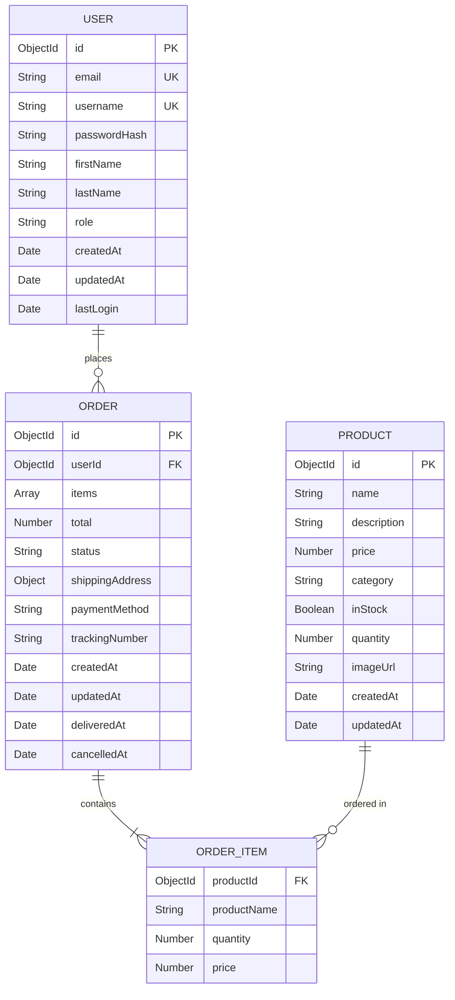

# Data Models Specification

**Version**: 1.0.0  
**Last Updated**: 2026-02-20  
**Database**: MongoDB  
**ODM**: Mongoose

---

## User Model

**Collection**: `users`

### Schema Definition

| Field | Type | Required | Unique | Default | Validation | Description |
|-------|------|----------|--------|---------|------------|-------------|
| id | ObjectId | Yes | Yes | Auto | - | Unique identifier |
| email | String | Yes | Yes | - | Valid email format, max 255 chars | User email address |
| username | String | Yes | Yes | - | 3-30 chars, alphanumeric + underscore | Unique username |
| passwordHash | String | Yes | No | - | - | Hashed password (bcrypt) |
| firstName | String | No | No | - | Max 50 chars | User's first name |
| lastName | String | No | No | - | Max 50 chars | User's last name |
| role | String | Yes | No | 'user' | Enum: user, admin | User role |
| createdAt | Date | Yes | No | Date.now | - | Account creation timestamp |
| updatedAt | Date | Yes | No | Date.now | - | Last update timestamp |
| lastLogin | Date | No | No | - | - | Last login timestamp |

### Indexes

```javascript
// Unique indexes for fast lookups and constraint enforcement
{ email: 1 }  // Unique
{ username: 1 }  // Unique

// Query optimization indexes
{ createdAt: -1 }  // For sorting by registration date
{ role: 1, createdAt: -1 }  // For admin queries
{ lastLogin: -1 }  // For activity tracking
```

### Business Rules

1. **Email Validation**: Must be valid email format
2. **Password Security**: Minimum 8 characters, must be hashed with bcrypt (10 rounds)
3. **Username Format**: 3-30 characters, alphanumeric and underscore only
4. **Role Assignment**: Default role is 'user', only admins can assign 'admin' role
5. **Soft Delete**: Users should be deactivated, not deleted (add `isActive` field in future)

### Example Document

```json
{
  "_id": "507f1f77bcf86cd799439011",
  "email": "john.doe@example.com",
  "username": "johndoe",
  "passwordHash": "$2b$10$abcdefghijklmnopqrstuvwxyz",
  "firstName": "John",
  "lastName": "Doe",
  "role": "user",
  "createdAt": "2026-02-25T10:30:00.000Z",
  "updatedAt": "2026-02-25T10:30:00.000Z",
  "lastLogin": "2026-02-25T15:45:00.000Z"
}
```

---

## Product Model

**Collection**: `products`

### Schema Definition

| Field | Type | Required | Default | Validation | Description |
|-------|------|----------|---------|------------|-------------|
| id | ObjectId | Yes | Auto | - | Unique identifier |
| name | String | Yes | - | 1-200 chars | Product name |
| description | String | No | - | Max 2000 chars | Product description |
| price | Number | Yes | - | Positive, max 2 decimals | Product price in USD |
| category | String | Yes | - | Enum: Electronics, Clothing, Books, Home, Sports, Other | Product category |
| inStock | Boolean | Yes | true | - | Availability status |
| quantity | Number | Yes | 0 | Non-negative integer | Available quantity |
| imageUrl | String | No | - | Valid URL | Product image URL |
| createdAt | Date | Yes | Date.now | - | Creation timestamp |
| updatedAt | Date | Yes | Date.now | - | Last update timestamp |

### Indexes

```javascript
// Text search index for product search
{ name: 'text', description: 'text' }

// Query optimization indexes
{ category: 1, price: 1 }  // For category browsing with price sorting
{ inStock: 1, category: 1 }  // For available products by category
{ createdAt: -1 }  // For newest products
{ price: 1 }  // For price sorting
```

### Business Rules

1. **Price Validation**: Must be positive number with maximum 2 decimal places
2. **Quantity Management**: Must be non-negative integer, updated when orders are placed
3. **Stock Status**: `inStock` is automatically set to false when `quantity` reaches 0
4. **Category Validation**: Must be one of the predefined categories
5. **Low Stock Alert**: System should alert when quantity < 10

### Example Document

```json
{
  "_id": "507f1f77bcf86cd799439012",
  "name": "Wireless Mouse",
  "description": "Ergonomic wireless mouse with USB receiver",
  "price": 29.99,
  "category": "Electronics",
  "inStock": true,
  "quantity": 150,
  "imageUrl": "https://example.com/images/mouse.jpg",
  "createdAt": "2026-02-20T10:00:00.000Z",
  "updatedAt": "2026-02-25T14:30:00.000Z"
}
```

---

## Order Model

**Collection**: `orders`

### Schema Definition

| Field | Type | Required | Default | Validation | Description |
|-------|------|----------|---------|------------|-------------|
| id | ObjectId | Yes | Auto | - | Unique identifier |
| userId | ObjectId | Yes | - | Valid User reference | Reference to User |
| items | Array | Yes | - | Min 1 item | Order items (see OrderItem) |
| total | Number | Yes | - | Positive, 2 decimals | Total order amount |
| status | String | Yes | 'pending' | Enum: pending, paid, processing, shipped, delivered, cancelled | Order status |
| shippingAddress | Object | Yes | - | - | Shipping address (see below) |
| paymentMethod | String | No | - | Enum: credit_card, debit_card, paypal | Payment method |
| trackingNumber | String | No | - | - | Shipping tracking number |
| createdAt | Date | Yes | Date.now | - | Order creation timestamp |
| updatedAt | Date | Yes | Date.now | - | Last update timestamp |
| deliveredAt | Date | No | - | - | Delivery timestamp |
| cancelledAt | Date | No | - | - | Cancellation timestamp |

### Nested Schemas

#### OrderItem

| Field | Type | Required | Validation | Description |
|-------|------|----------|------------|-------------|
| productId | ObjectId | Yes | Valid Product reference | Reference to Product |
| productName | String | Yes | - | Product name at time of order |
| quantity | Number | Yes | Positive integer | Quantity ordered |
| price | Number | Yes | Positive, 2 decimals | Price at time of order |

#### ShippingAddress

| Field | Type | Required | Validation | Description |
|-------|------|----------|------------|-------------|
| street | String | Yes | Max 200 chars | Street address |
| city | String | Yes | Max 100 chars | City |
| state | String | Yes | Max 100 chars | State/Province |
| zipCode | String | Yes | Max 20 chars | Postal code |
| country | String | Yes | Max 100 chars | Country |

### Indexes

```javascript
// User orders lookup
{ userId: 1, createdAt: -1 }  // For user order history

// Status queries
{ status: 1, createdAt: -1 }  // For order management

// Admin queries
{ createdAt: -1 }  // For recent orders
{ status: 1, userId: 1 }  // For user-specific status queries
```

### Status Transitions

Valid status transitions:
- `pending` → `paid`, `cancelled`
- `paid` → `processing`, `cancelled`
- `processing` → `shipped`, `cancelled`
- `shipped` → `delivered`
- `delivered` → (final state)
- `cancelled` → (final state)

### Business Rules

1. **Order Validation**: Must contain at least one item
2. **Inventory Check**: Product availability must be verified before order creation
3. **Price Snapshot**: Product prices are captured at order time (not referenced)
4. **Total Calculation**: Total must equal sum of (item.price × item.quantity)
5. **Cancellation Rules**: Only orders with status 'pending' or 'paid' can be cancelled
6. **Inventory Restoration**: Cancelled orders must restore product inventory
7. **Status Timestamps**: Set `deliveredAt` when status becomes 'delivered', `cancelledAt` when 'cancelled'

### Example Document

```json
{
  "_id": "507f1f77bcf86cd799439013",
  "userId": "507f1f77bcf86cd799439011",
  "items": [
    {
      "productId": "507f1f77bcf86cd799439012",
      "productName": "Wireless Mouse",
      "quantity": 2,
      "price": 29.99
    }
  ],
  "total": 59.98,
  "status": "delivered",
  "shippingAddress": {
    "street": "123 Main St",
    "city": "Springfield",
    "state": "IL",
    "zipCode": "62701",
    "country": "USA"
  },
  "paymentMethod": "credit_card",
  "trackingNumber": "1Z999AA10123456784",
  "createdAt": "2026-02-25T16:00:00.000Z",
  "updatedAt": "2026-02-26T10:00:00.000Z",
  "deliveredAt": "2026-02-26T10:00:00.000Z"
}
```

---

## Entity Relationships



---

## Data Integrity Rules

### Referential Integrity

1. **User-Order Relationship**: Orders must reference valid users
2. **Product-OrderItem Relationship**: Order items must reference valid products at creation time
3. **Orphan Prevention**: Deleting users should not delete their orders (historical data)

### Consistency Rules

1. **Price Consistency**: Order item prices are snapshots, not live references
2. **Inventory Consistency**: Product quantity must be updated atomically with order creation
3. **Status Consistency**: Order status transitions must follow defined rules

### Validation Rules

1. **Email Uniqueness**: Enforced at database level with unique index
2. **Username Uniqueness**: Enforced at database level with unique index
3. **Positive Values**: Prices and quantities must be positive
4. **Required Fields**: All required fields must be present and non-null

---

## Migration Notes

### Version 1.0.0 (Initial Schema)

- Created User, Product, and Order models
- Established indexes for query optimization
- Defined validation rules and constraints

### Future Enhancements (v1.1.0)

- Add `isActive` field to User model for soft delete
- Add `reviews` collection for product reviews
- Add `wishlist` field to User model
- Add `discount` field to Order model for promotions
- Add `tags` array to Product model for better categorization