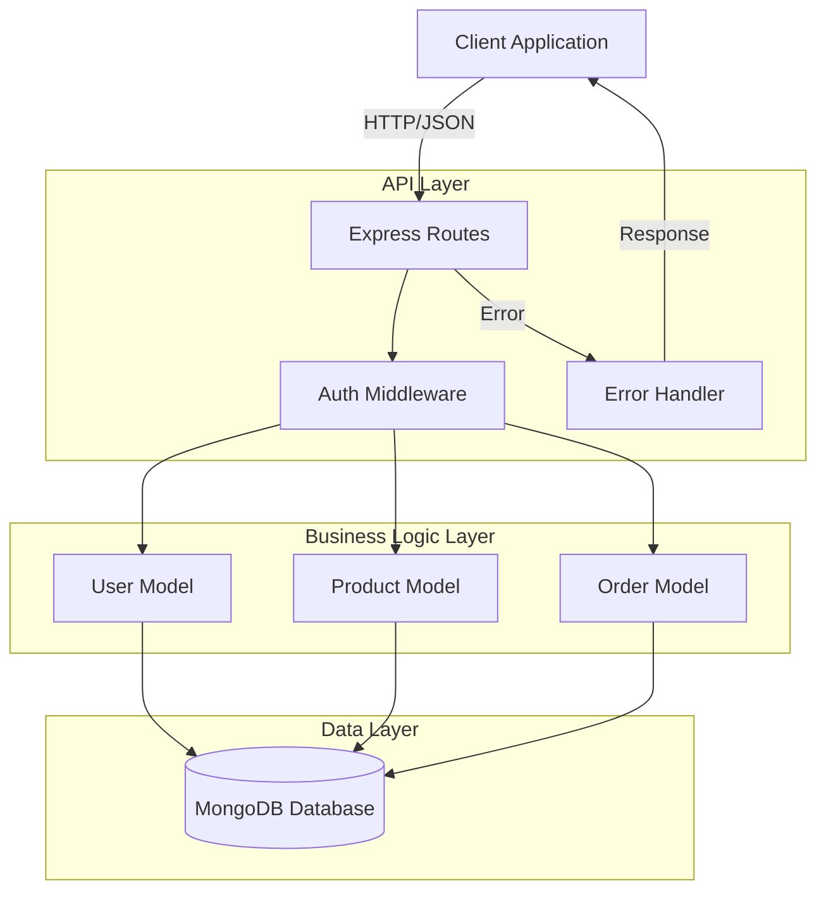
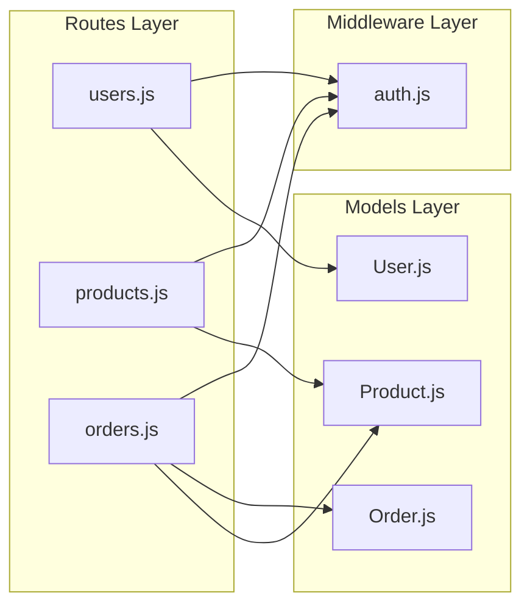
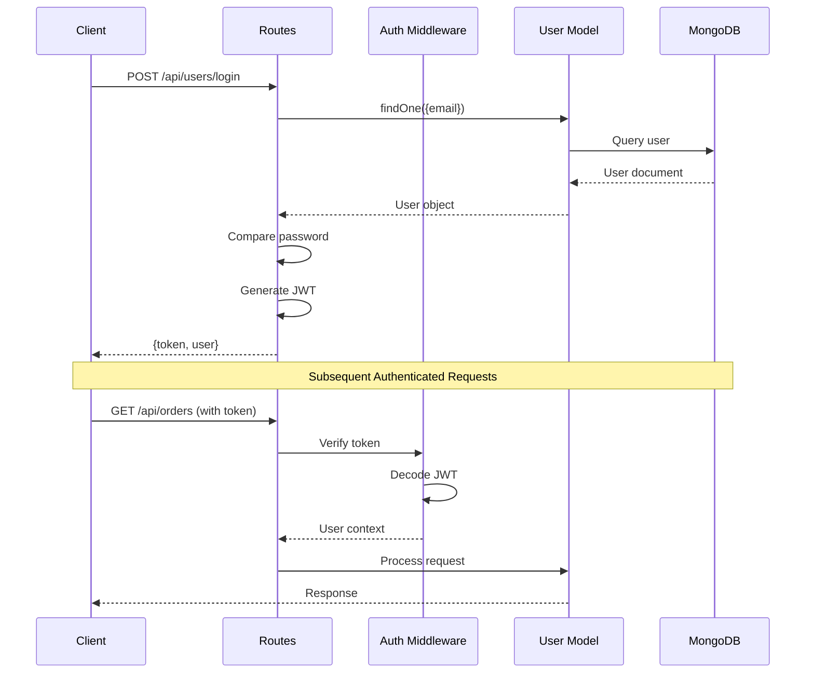
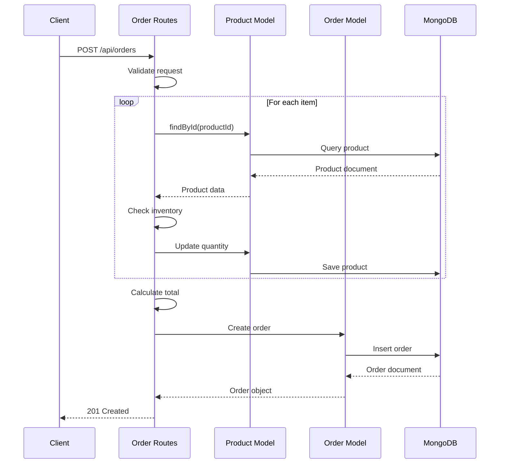
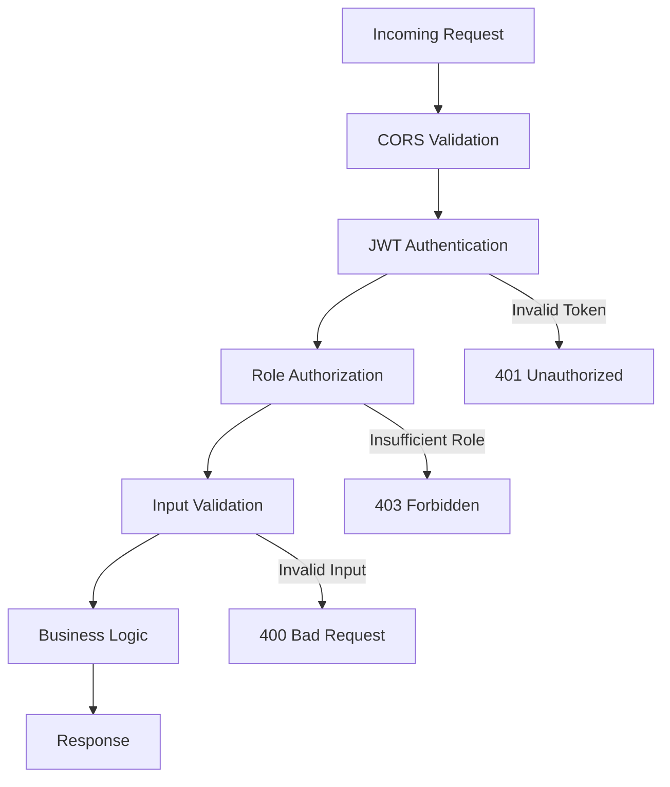
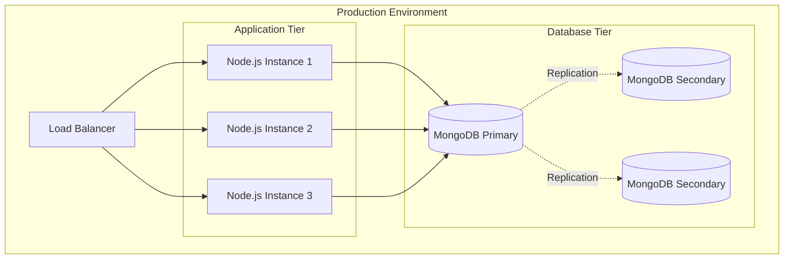

# System Architecture Documentation

**Generated**: 2026-02-26T16:03:59Z  
**Source**: Automated analysis of codebase  
**Version**: 1.0.0

## Table of Contents

1. [Overview](#overview)
2. [Technology Stack](#technology-stack)
3. [System Architecture](#system-architecture)
4. [Component Structure](#component-structure)
5. [Data Flow](#data-flow)
6. [Security Architecture](#security-architecture)
7. [Deployment Architecture](#deployment-architecture)

## Overview

This is an e-commerce platform built with Node.js, Express, and MongoDB. The system follows a three-tier architecture pattern with clear separation between API routes, business logic (models), and middleware layers.

### Key Characteristics

- **Architecture Pattern**: Three-tier (Presentation, Business Logic, Data)
- **API Style**: RESTful HTTP/JSON
- **Authentication**: JWT-based token authentication
- **Database**: MongoDB with Mongoose ODM
- **Authorization**: Role-based access control (RBAC)

## Technology Stack

### Backend Framework
- **Runtime**: Node.js (>=18.0.0)
- **Framework**: Express.js 4.18.2
- **Language**: JavaScript (ES6+)

### Database & ODM
- **Database**: MongoDB
- **ODM**: Mongoose 7.6.0
- **Schema Validation**: Mongoose schema validators

### Security
- **Password Hashing**: bcrypt 5.1.1
- **Authentication**: JSON Web Tokens (jsonwebtoken 9.0.2)
- **CORS**: cors 2.8.5

### Development Tools
- **Process Manager**: nodemon 3.0.1
- **Testing**: Jest 29.7.0
- **Environment**: dotenv 16.3.1

## System Architecture



## Component Structure

### Directory Layout

```
src/
├── api/
│   ├── middleware/
│   │   └── auth.js          # Authentication & authorization
│   └── routes/
│       ├── users.js         # User management endpoints
│       ├── products.js      # Product catalog endpoints
│       └── orders.js        # Order processing endpoints
└── models/
    ├── User.js              # User data model
    ├── Product.js           # Product data model
    └── Order.js             # Order data model
```

### Component Diagram



## Data Flow

### Authentication Flow



### Order Creation Flow



## Security Architecture

### Authentication Mechanism

The system uses JWT (JSON Web Tokens) for stateless authentication:

1. **Token Generation**: Upon successful login, a JWT is generated containing:
   - `userId`: User's unique identifier
   - `role`: User's role (user/admin)
   - `expiresIn`: 24-hour expiration

2. **Token Verification**: The [`authenticate()`](src/api/middleware/auth.js:7) middleware:
   - Extracts token from `Authorization: Bearer <token>` header
   - Verifies token signature using JWT_SECRET
   - Attaches decoded user info to request object

3. **Authorization**: The [`requireAdmin()`](src/api/middleware/auth.js:43) middleware:
   - Checks user role from decoded token
   - Restricts access to admin-only endpoints

### Security Layers



### Password Security

- **Hashing Algorithm**: bcrypt with salt rounds = 10
- **Storage**: Only password hashes stored, never plaintext
- **Comparison**: Secure comparison via [`comparePassword()`](src/models/User.js:71) method

### Data Protection

- **Sensitive Field Exclusion**: [`toJSON()`](src/models/User.js:76) method removes `passwordHash` from responses
- **User Isolation**: Orders and profiles restricted to owning user
- **Admin Protection**: Product creation/updates require admin role

## Deployment Architecture

### Environment Configuration

Required environment variables:
- `JWT_SECRET`: Secret key for JWT signing (default: 'default-secret')
- `MONGODB_URI`: MongoDB connection string
- `PORT`: Server port (default: 3000)
- `NODE_ENV`: Environment (development/production)

### Recommended Deployment



### Scalability Considerations

1. **Horizontal Scaling**: Stateless JWT authentication enables multiple app instances
2. **Database Indexing**: Strategic indexes on frequently queried fields
3. **Connection Pooling**: Mongoose manages MongoDB connection pool
4. **Caching Strategy**: Consider Redis for session/token caching in production

### Performance Optimizations

- **Database Indexes**: Implemented on:
  - User: email, username, createdAt, role, lastLogin
  - Product: text search, category+price, inStock+category, createdAt, price
  - Order: userId+createdAt, status+createdAt, status+userId

- **Query Optimization**:
  - Pagination with skip/limit
  - Field selection with `.select()`
  - Parallel queries with `Promise.all()`

- **Pre-save Hooks**:
  - Automatic timestamp updates
  - Inventory management
  - Status-based field updates

## Component Details

### Models Layer

#### User Model ([`User.js`](src/models/User.js:1))

**Responsibilities**:
- User account management
- Password hashing and verification
- Role-based access control
- Profile data storage

**Key Methods**:
- [`comparePassword(candidatePassword)`](src/models/User.js:71): Secure password comparison
- [`toJSON()`](src/models/User.js:76): Safe serialization excluding sensitive fields

**Indexes**: email, username, createdAt, role+createdAt, lastLogin

#### Product Model ([`Product.js`](src/models/Product.js:1))

**Responsibilities**:
- Product catalog management
- Inventory tracking
- Category organization
- Search functionality

**Pre-save Hook**: Automatically updates `inStock` based on `quantity`

**Indexes**: Text search (name, description), category+price, inStock+category, createdAt, price

#### Order Model ([`Order.js`](src/models/Order.js:1))

**Responsibilities**:
- Order lifecycle management
- Order item tracking
- Shipping address storage
- Status workflow

**Key Methods**:
- [`canBeCancelled()`](src/models/Order.js:123): Business rule validation

**Pre-save Hook**: Automatic `cancelledAt` timestamp on cancellation

**Indexes**: userId+createdAt, status+createdAt, status+userId

### Routes Layer

#### User Routes ([`users.js`](src/api/routes/users.js:1))

**Endpoints**:
- `POST /api/users`: User registration
- `POST /api/users/login`: Authentication
- `GET /api/users/:id`: Profile retrieval (authenticated)
- `PUT /api/users/:id`: Profile update (authenticated, self-only)

#### Product Routes ([`products.js`](src/api/routes/products.js:1))

**Endpoints**:
- `POST /api/products/search`: Product search with filters
- `GET /api/products/:id`: Product details
- `POST /api/products`: Create product (admin only)
- `GET /api/products/recommendations/:id`: Product recommendations

#### Order Routes ([`orders.js`](src/api/routes/orders.js:1))

**Endpoints**:
- `POST /api/orders`: Create order (authenticated)
- `GET /api/orders`: Order history (authenticated)
- `GET /api/orders/:id`: Order details (authenticated, owner only)
- `PATCH /api/orders/:id/cancel`: Cancel order (authenticated, owner only)
- `POST /api/orders/webhook/status`: Status webhook (internal)

### Middleware Layer

#### Authentication Middleware ([`auth.js`](src/api/middleware/auth.js:1))

**Functions**:
- [`authenticate(req, res, next)`](src/api/middleware/auth.js:7): JWT verification
- [`requireAdmin(req, res, next)`](src/api/middleware/auth.js:43): Admin role check

## Design Patterns

### Repository Pattern
Models encapsulate data access logic, providing clean interface to routes.

### Middleware Chain
Express middleware pattern for cross-cutting concerns (auth, validation, error handling).

### Schema Validation
Mongoose schemas enforce data integrity at the model level.

### Pre-save Hooks
Automatic data transformations and business rule enforcement.

### Method Encapsulation
Business logic methods on model instances (e.g., `canBeCancelled()`, `comparePassword()`).

## Quality Attributes

### Maintainability
- Clear separation of concerns
- Consistent error handling patterns
- Self-documenting code structure

### Security
- JWT-based stateless authentication
- Password hashing with bcrypt
- Role-based authorization
- Input validation

### Performance
- Strategic database indexing
- Query optimization with pagination
- Parallel query execution
- Connection pooling

### Scalability
- Stateless authentication enables horizontal scaling
- MongoDB supports sharding for data distribution
- Microservices-ready architecture

---

**Documentation Quality**: ✅ Complete  
**Last Updated**: 2026-02-26T16:03:59Z  
**Generated By**: Bob Documentation Generation Mode