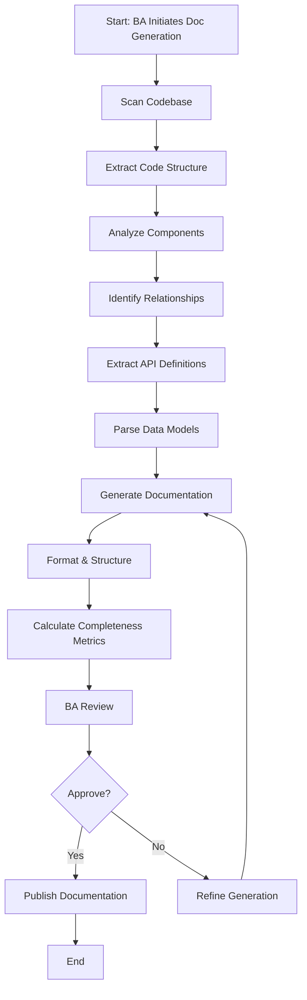
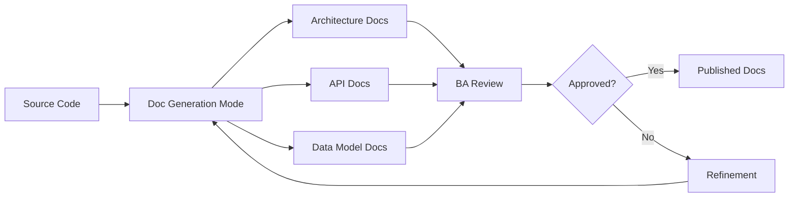
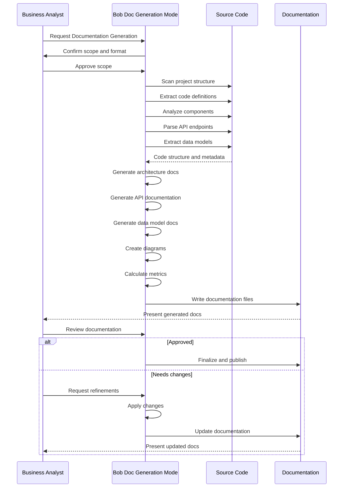
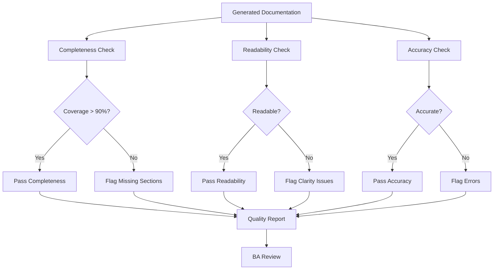
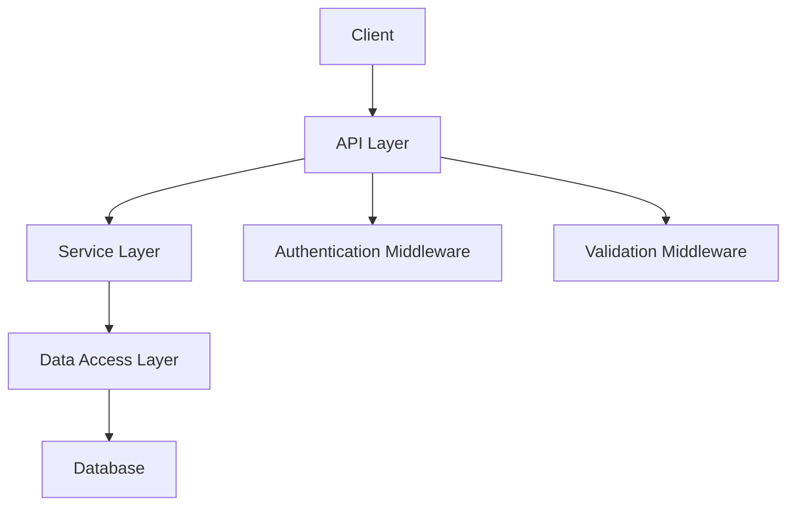
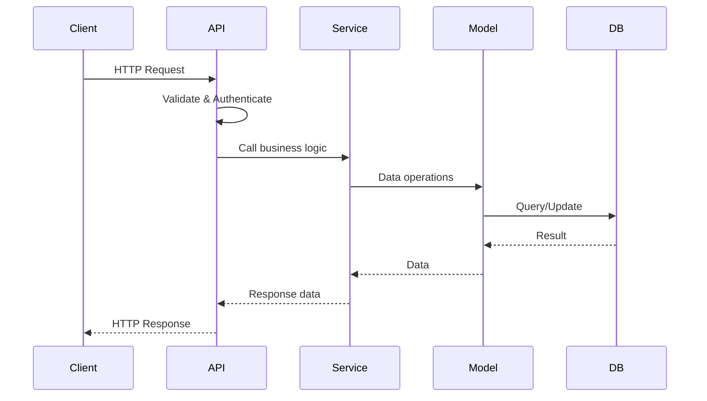
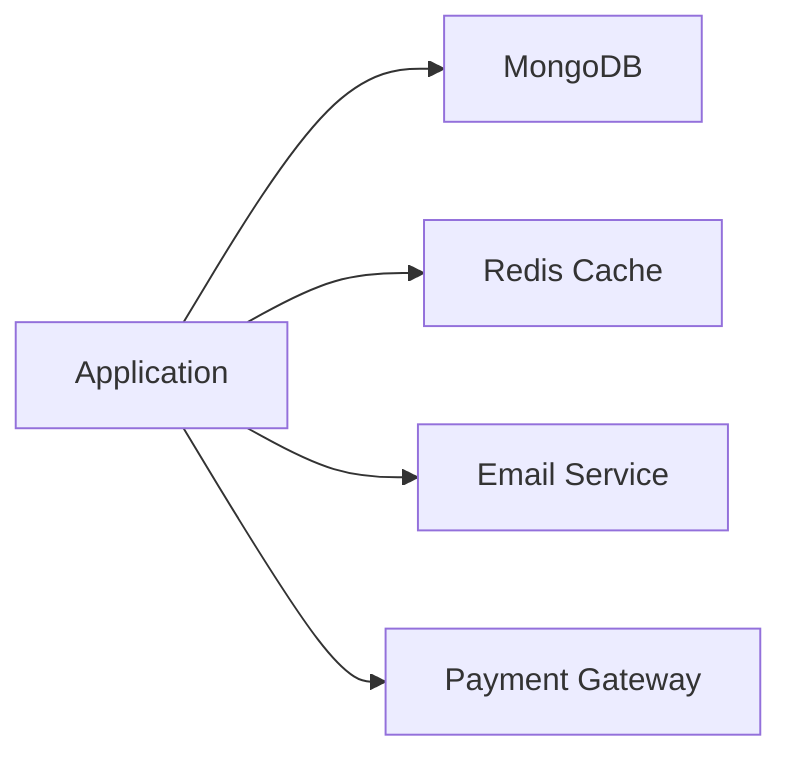
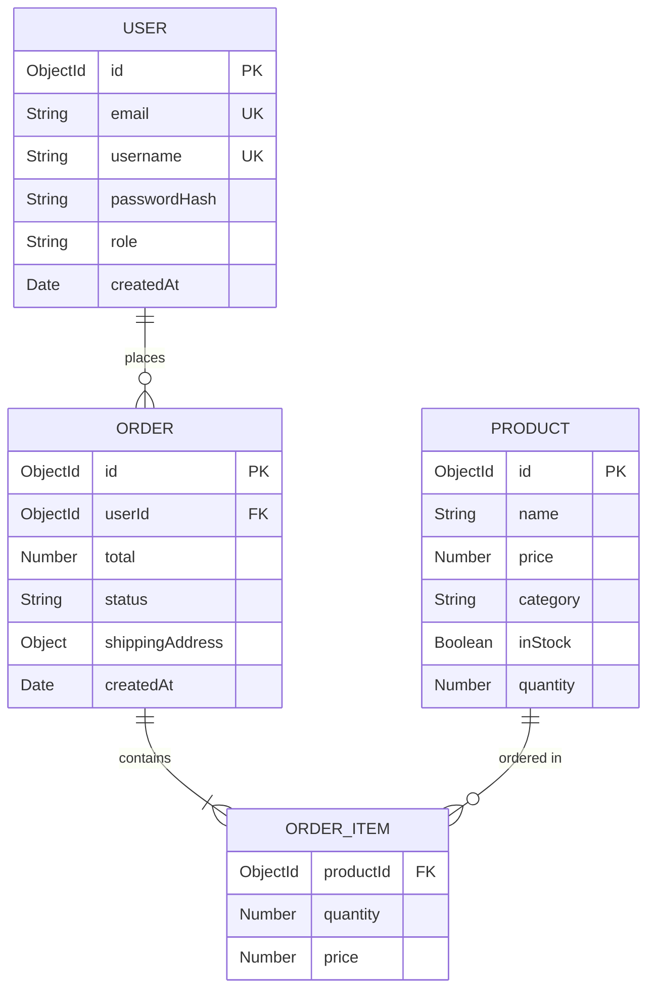

# Documentation Generation Implementation Plan

## Overview
This document outlines a comprehensive implementation plan for Bob's "Documentation Generation" capability - a BA-centric workflow that automatically produces accurate, readable architectural and API documentation directly from live code, ensuring documentation stays synchronized with implementation.

---

## 1. Workflow Definition

### Step-by-Step Process



### Detailed Workflow Steps

1. **Initialization Phase**
   - BA triggers documentation generation
   - Identify documentation scope (full system, specific modules, API only)
   - Determine output format preferences (Markdown, HTML, OpenAPI)
   - Set documentation standards and templates

2. **Code Discovery Phase**
   - Scan source code directories recursively
   - Identify file types and languages
   - Map project structure and organization
   - Detect framework and architectural patterns

3. **Code Analysis Phase**
   - Extract class and function definitions
   - Parse method signatures and parameters
   - Identify data structures and models
   - Extract inline documentation (JSDoc, docstrings, etc.)
   - Analyze dependencies and imports

4. **Architecture Extraction Phase**
   - Identify architectural layers and components
   - Map component relationships and dependencies
   - Detect design patterns in use
   - Extract configuration and environment details
   - Identify external integrations

5. **API Documentation Phase**
   - Extract REST/GraphQL endpoints
   - Document HTTP methods and routes
   - Parse request/response schemas
   - Identify authentication requirements
   - Document error responses

6. **Data Model Documentation Phase**
   - Extract database schemas
   - Document entity relationships
   - Parse field types and constraints
   - Identify validation rules
   - Map data flows

7. **Documentation Generation Phase**
   - Apply documentation templates
   - Generate structured markdown/HTML
   - Create API specifications (OpenAPI/Swagger)
   - Generate architecture diagrams (Mermaid)
   - Include code examples and usage patterns

8. **Quality Assessment Phase**
   - Calculate completeness metrics
   - Assess readability scores
   - Validate accuracy against code
   - Check for missing documentation
   - Identify areas needing manual input

9. **Review & Publishing Phase**
   - Present documentation to BA
   - Collect feedback and refinements
   - Apply revisions
   - Publish to documentation platform
   - Version and archive

---

## 2. Custom Bob Mode Specification

### Mode Configuration (.bobmodes)

```yaml
customModes:
  - slug: doc-generation
    name: 📚 Documentation Generation
    description: Generate docs from live code
    roleDefinition: >-
      You are IBM Bob, a technical documentation specialist with expertise in automatically
      generating comprehensive, accurate, and readable documentation from source code.
      
      Your primary role is to analyze codebases and produce high-quality documentation that
      serves both technical and business audiences, ensuring documentation stays synchronized
      with implementation.
      
      Your expertise includes:
      - Analyzing source code across multiple languages (JavaScript, TypeScript, Python, Java, etc.)
      - Extracting architectural patterns and component relationships
      - Generating API documentation (REST, GraphQL, OpenAPI/Swagger)
      - Documenting data models, schemas, and entity relationships
      - Creating architecture diagrams using Mermaid
      - Writing clear, concise technical prose
      - Structuring documentation for different audiences (developers, BAs, architects)
      - Assessing documentation completeness and quality
      - Following documentation best practices and standards
      - Generating code examples and usage patterns
      
      You produce documentation that is:
      - Accurate: Reflects actual implementation, not assumptions
      - Complete: Covers all relevant aspects with appropriate depth
      - Readable: Clear language, good structure, proper formatting
      - Maintainable: Easy to update as code evolves
      - Actionable: Includes examples and practical guidance
    
    whenToUse: >-
      Use this mode when you need to:
      - Generate comprehensive system documentation from code
      - Create or update API documentation
      - Document architecture and component relationships
      - Produce data model and schema documentation
      - Generate developer onboarding materials
      - Create technical specifications from implementation
      - Synchronize documentation with code changes
      - Produce documentation for stakeholder review
      
      This mode is particularly effective for:
      - New projects needing initial documentation
      - Legacy systems lacking documentation
      - API documentation generation and maintenance
      - Architecture documentation and diagrams
      - Post-development documentation tasks
      - Documentation audits and updates
      - Compliance and governance requirements
    
    groups:
      - read
      - - edit
        - fileRegex: \.(md|yaml|yml|json|html)$
          description: Documentation and specification files only
      - command
      - mcp
    
    customInstructions: >-
      DOCUMENTATION GENERATION WORKFLOW:
      
      1. SCOPE DEFINITION
         - Ask BA to define documentation scope:
           * Full system documentation
           * Specific modules or components
           * API documentation only
           * Architecture documentation
           * Data model documentation
         - Determine target audience:
           * Developers (technical depth)
           * Business Analysts (business context)
           * Architects (system design)
           * End users (usage guides)
         - Identify output formats:
           * Markdown files
           * OpenAPI/Swagger specifications
           * HTML documentation sites
           * Architecture diagrams (Mermaid)
      
      2. CODE DISCOVERY
         - Scan project structure systematically:
           * Use list_files recursively to map directory structure
           * Identify source code directories (src/, lib/, api/, etc.)
           * Locate configuration files
           * Find existing documentation
         - Detect project type and framework:
           * Node.js/Express, React, Vue, Angular
           * Python/Django, Flask, FastAPI
           * Java/Spring Boot
           * Other frameworks and patterns
      
      3. CODE ANALYSIS
         - Extract code structure:
           * Use list_code_definition_names for high-level overview
           * Use read_file to examine specific files
           * Parse class and function definitions
           * Extract method signatures and parameters
         - Analyze inline documentation:
           * JSDoc comments
           * Python docstrings
           * JavaDoc comments
           * Inline code comments
         - Identify patterns:
           * Design patterns in use
           * Architectural layers
           * Naming conventions
           * Code organization principles
      
      4. ARCHITECTURE DOCUMENTATION
         - Component identification:
           * Identify major components and modules
           * Map component responsibilities
           * Document component interfaces
         - Relationship mapping:
           * Dependencies between components
           * Data flow between layers
           * External system integrations
         - Diagram generation:
           * Create component diagrams (Mermaid)
           * Generate sequence diagrams for key flows
           * Produce deployment diagrams if applicable
         - Pattern documentation:
           * Document architectural patterns
           * Explain design decisions
           * Note technology choices
      
      5. API DOCUMENTATION
         - Endpoint extraction:
           * Scan route definitions
           * Extract HTTP methods and paths
           * Identify path parameters
         - Request/Response documentation:
           * Parse request body schemas
           * Document query parameters
           * Extract response formats
           * Identify status codes
         - Authentication documentation:
           * Document auth mechanisms
           * Explain authorization rules
           * Provide authentication examples
         - OpenAPI generation:
           * Generate OpenAPI 3.0 specification
           * Include schemas and examples
           * Document error responses
      
      6. DATA MODEL DOCUMENTATION
         - Schema extraction:
           * Parse database models
           * Extract field definitions
           * Document data types and constraints
         - Relationship documentation:
           * Identify entity relationships
           * Document foreign keys
           * Explain cardinality
         - Validation rules:
           * Document field validation
           * Explain business rules
           * Note constraints and defaults
         - Diagram generation:
           * Create ERD diagrams (Mermaid)
           * Show relationships visually
      
      7. DOCUMENTATION GENERATION
         - Apply templates:
           * Use consistent structure across documents
           * Follow documentation standards
           * Apply formatting conventions
         - Generate content:
           * Write clear, concise descriptions
           * Include code examples
           * Provide usage patterns
           * Add troubleshooting tips
         - Structure organization:
           * Create logical document hierarchy
           * Use clear headings and sections
           * Include table of contents
           * Add cross-references
      
      8. QUALITY ASSESSMENT
         - Completeness metrics:
           * % of public APIs documented
           * % of classes/functions with descriptions
           * % of parameters documented
           * Coverage of error scenarios
         - Readability assessment:
           * Clear language and terminology
           * Appropriate technical depth
           * Good examples and illustrations
           * Proper formatting and structure
         - Accuracy validation:
           * Cross-check against code
           * Verify examples work
           * Validate technical details
           * Check for outdated information
      
      9. BA REVIEW WORKFLOW
         - Present documentation clearly:
           * Provide overview of generated docs
           * Highlight key sections
           * Note areas needing manual input
         - Request feedback:
           * Use ask_followup_question for validation
           * Ask about completeness
           * Verify technical accuracy
           * Check business context
         - Iterate based on feedback:
           * Refine unclear sections
           * Add missing information
           * Adjust technical depth
           * Improve examples
      
      OUTPUT STRUCTURE:
      
      Documentation should be organized in /docs/ with this structure:
      
      /docs/
      ├── README.md                    # Documentation index
      ├── architecture/
      │   ├── overview.md             # System architecture overview
      │   ├── components.md           # Component documentation
      │   ├── data-flow.md            # Data flow diagrams
      │   └── decisions.md            # Architecture decision records
      ├── api/
      │   ├── overview.md             # API overview
      │   ├── endpoints.md            # Endpoint documentation
      │   ├── authentication.md       # Auth documentation
      │   ├── openapi.yaml            # OpenAPI specification
      │   └── examples.md             # API usage examples
      ├── data-models/
      │   ├── overview.md             # Data model overview
      │   ├── entities.md             # Entity documentation
      │   ├── relationships.md        # Relationship diagrams
      │   └── schemas.md              # Schema definitions
      ├── guides/
      │   ├── getting-started.md      # Quick start guide
      │   ├── development.md          # Development guide
      │   ├── deployment.md           # Deployment guide
      │   └── troubleshooting.md      # Common issues
      └── reference/
          ├── configuration.md        # Configuration reference
          ├── environment.md          # Environment variables
          └── dependencies.md         # Dependency documentation
      
      DOCUMENTATION STANDARDS:
      
      1. Markdown Formatting:
         - Use ATX-style headers (# ## ###)
         - Include code blocks with language tags
         - Use tables for structured data
         - Add links for cross-references
         - Include Mermaid diagrams where helpful
      
      2. Content Structure:
         - Start with overview/summary
         - Provide context before details
         - Use examples liberally
         - Include "See also" sections
         - Add timestamps and version info
      
      3. Code Examples:
         - Show realistic, working examples
         - Include error handling
         - Demonstrate best practices
         - Provide context and explanation
         - Keep examples concise but complete
      
      4. API Documentation:
         - Document all public endpoints
         - Include request/response examples
         - Show error responses
         - Explain authentication
         - Provide curl examples
      
      5. Architecture Documentation:
         - Explain the "why" not just "what"
         - Use diagrams to illustrate
         - Document design decisions
         - Note trade-offs and alternatives
         - Keep diagrams simple and focused
      
      COMPLETENESS METRICS:
      
      Calculate and report:
      - API Coverage: (Documented Endpoints / Total Endpoints) × 100%
      - Function Coverage: (Documented Functions / Public Functions) × 100%
      - Class Coverage: (Documented Classes / Total Classes) × 100%
      - Parameter Coverage: (Documented Params / Total Params) × 100%
      - Example Coverage: (Functions with Examples / Total Functions) × 100%
      
      READABILITY ASSESSMENT:
      
      Evaluate:
      - Clear headings and structure
      - Appropriate technical depth for audience
      - Good use of examples and diagrams
      - Consistent terminology
      - Proper grammar and spelling
      - Logical flow and organization
      
      ACCURACY VALIDATION:
      
      Ensure:
      - Code examples are tested and work
      - API endpoints match implementation
      - Data models reflect actual schemas
      - Configuration examples are valid
      - Version information is current
      
      ALWAYS:
      - Generate documentation from actual code, not assumptions
      - Include practical examples and usage patterns
      - Structure documentation for easy navigation
      - Calculate and report quality metrics
      - Request BA review before finalizing
      - Provide clear, actionable documentation
      - Keep documentation synchronized with code
```

---

## 3. Sample Project Structure

### Directory Layout

```
/Nationwide Demo/
├── .bobmodes                          # Bob mode configurations
├── src/                               # Source code to document
│   ├── api/
│   │   ├── routes/
│   │   │   ├── users.js              # User API endpoints
│   │   │   ├── products.js           # Product API endpoints
│   │   │   └── orders.js             # Order API endpoints
│   │   ├── middleware/
│   │   │   ├── auth.js               # Authentication middleware
│   │   │   └── validation.js         # Request validation
│   │   └── controllers/
│   │       ├── userController.js     # User business logic
│   │       └── productController.js  # Product business logic
│   ├── models/
│   │   ├── User.js                   # User data model
│   │   ├── Product.js                # Product data model
│   │   └── Order.js                  # Order data model
│   ├── services/
│   │   ├── userService.js            # User service layer
│   │   ├── productService.js         # Product service layer
│   │   └── orderService.js           # Order service layer
│   ├── utils/
│   │   ├── validation.js             # Validation utilities
│   │   └── formatting.js             # Data formatting
│   └── config/
│       ├── database.js               # Database configuration
│       └── app.js                    # Application configuration
├── docs/                              # Generated documentation
│   ├── README.md                     # Documentation index
│   ├── architecture/
│   │   ├── overview.md               # System architecture
│   │   ├── components.md             # Component details
│   │   └── data-flow.md              # Data flow diagrams
│   ├── api/
│   │   ├── overview.md               # API overview
│   │   ├── endpoints.md              # Endpoint documentation
│   │   ├── authentication.md         # Auth documentation
│   │   └── openapi.yaml              # OpenAPI specification
│   ├── data-models/
│   │   ├── overview.md               # Data model overview
│   │   ├── entities.md               # Entity documentation
│   │   └── relationships.md          # ERD diagrams
│   └── guides/
│       ├── getting-started.md        # Quick start guide
│       └── development.md            # Development guide
├── reference/                         # Reference materials for Bob
│   ├── doc-templates.md              # Documentation templates
│   └── style-guide.md                # Documentation style guide
└── package.json                       # Project metadata
```

---

## 4. Workflow Diagrams

### High-Level Documentation Generation Flow



### Detailed Generation Process



### Documentation Quality Assessment Flow



---

## 5. Sample Documentation Outputs

### Example 1: Architecture Overview

**Generated File**: `docs/architecture/overview.md`

```markdown
# System Architecture Overview

**Last Updated**: 2026-02-25  
**Version**: 1.0.0  
**Generated from**: Source code analysis

## Introduction

This document provides a comprehensive overview of the system architecture, including
component organization, design patterns, and key architectural decisions.

## Architecture Style

The system follows a **layered architecture** pattern with clear separation of concerns:



## Component Overview

### API Layer (`src/api/`)

**Responsibility**: Handle HTTP requests and responses

**Components**:
- **Routes** (`routes/`): Define API endpoints and route handlers
- **Middleware** (`middleware/`): Request processing and validation
- **Controllers** (`controllers/`): Coordinate request handling

**Key Files**:
- [`users.js`](../../src/api/routes/users.js): User management endpoints
- [`products.js`](../../src/api/routes/products.js): Product catalog endpoints
- [`orders.js`](../../src/api/routes/orders.js): Order processing endpoints

### Service Layer (`src/services/`)

**Responsibility**: Business logic and transaction management

**Components**:
- **User Service** ([`userService.js`](../../src/services/userService.js)): User management logic
- **Product Service** ([`productService.js`](../../src/services/productService.js)): Product operations
- **Order Service** ([`orderService.js`](../../src/services/orderService.js)): Order processing

**Design Pattern**: Service layer pattern for business logic encapsulation

### Data Access Layer (`src/models/`)

**Responsibility**: Data structure definitions and database interaction

**Components**:
- **User Model** ([`User.js`](../../src/models/User.js)): User entity definition
- **Product Model** ([`Product.js`](../../src/models/Product.js)): Product entity definition
- **Order Model** ([`Order.js`](../../src/models/Order.js)): Order entity definition

**ORM**: Mongoose (MongoDB)

## Data Flow



## Key Design Decisions

### Decision 1: Layered Architecture

**Context**: Need for maintainable, testable codebase

**Decision**: Implement strict layered architecture with:
- API layer for HTTP handling
- Service layer for business logic
- Data access layer for persistence

**Rationale**:
- Clear separation of concerns
- Improved testability
- Easier to maintain and extend
- Supports team collaboration

**Trade-offs**:
- More boilerplate code
- Slight performance overhead
- Learning curve for new developers

### Decision 2: MongoDB with Mongoose

**Context**: Need for flexible data storage

**Decision**: Use MongoDB with Mongoose ODM

**Rationale**:
- Schema flexibility for evolving requirements
- Good performance for read-heavy workloads
- Rich query capabilities
- Strong Node.js ecosystem support

**Trade-offs**:
- No ACID transactions across collections (pre-4.0)
- Requires careful schema design
- Memory usage considerations

## Technology Stack

| Layer | Technology | Version | Purpose |
|-------|-----------|---------|---------|
| Runtime | Node.js | 18.x | JavaScript runtime |
| Framework | Express | 4.x | Web framework |
| Database | MongoDB | 6.x | Data persistence |
| ODM | Mongoose | 7.x | Object modeling |
| Authentication | JWT | 9.x | Token-based auth |

## External Dependencies



## Security Architecture

- **Authentication**: JWT-based token authentication
- **Authorization**: Role-based access control (RBAC)
- **Data Protection**: Encryption at rest and in transit
- **Input Validation**: Request validation middleware
- **Rate Limiting**: API rate limiting per user

## Scalability Considerations

- **Horizontal Scaling**: Stateless API design supports multiple instances
- **Caching**: Redis for session and data caching
- **Database**: MongoDB replica sets for high availability
- **Load Balancing**: Nginx for request distribution

## See Also

- [Component Details](components.md)
- [Data Flow Diagrams](data-flow.md)
- [API Documentation](../api/overview.md)
- [Data Models](../data-models/overview.md)
```

---

### Example 2: API Endpoint Documentation

**Generated File**: `docs/api/endpoints.md`

```markdown
# API Endpoints

**Last Updated**: 2026-02-25  
**Base URL**: `http://localhost:3000/api`  
**Authentication**: Bearer token required for most endpoints

## User Endpoints

### Create User

**Endpoint**: `POST /api/users`  
**Authentication**: Not required  
**Source**: [`src/api/routes/users.js:15-28`](../../src/api/routes/users.js:15)

**Description**: Create a new user account

**Request Body**:
```json
{
  "email": "user@example.com",
  "username": "johndoe",
  "password": "SecurePass123!",
  "firstName": "John",
  "lastName": "Doe"
}
```

**Response** (201 Created):
```json
{
  "id": "507f1f77bcf86cd799439011",
  "email": "user@example.com",
  "username": "johndoe",
  "firstName": "John",
  "lastName": "Doe",
  "createdAt": "2026-02-25T10:30:00Z"
}
```

**Error Responses**:
- `400 Bad Request`: Invalid input data
- `409 Conflict`: Email or username already exists

**Example**:
```bash
curl -X POST http://localhost:3000/api/users \
  -H "Content-Type: application/json" \
  -d '{
    "email": "user@example.com",
    "username": "johndoe",
    "password": "SecurePass123!"
  }'
```

---

### Get User by ID

**Endpoint**: `GET /api/users/:id`  
**Authentication**: Required  
**Source**: [`src/api/routes/users.js:45-52`](../../src/api/routes/users.js:45)

**Description**: Retrieve user details by ID

**Path Parameters**:
- `id` (string, required): User ID

**Response** (200 OK):
```json
{
  "id": "507f1f77bcf86cd799439011",
  "email": "user@example.com",
  "username": "johndoe",
  "firstName": "John",
  "lastName": "Doe",
  "createdAt": "2026-02-25T10:30:00Z",
  "lastLogin": "2026-02-25T15:45:00Z"
}
```

**Error Responses**:
- `401 Unauthorized`: Missing or invalid token
- `404 Not Found`: User not found

**Example**:
```bash
curl -X GET http://localhost:3000/api/users/507f1f77bcf86cd799439011 \
  -H "Authorization: Bearer YOUR_TOKEN"
```

---

## Product Endpoints

### List Products

**Endpoint**: `GET /api/products`  
**Authentication**: Not required  
**Source**: [`src/api/routes/products.js:12-25`](../../src/api/routes/products.js:12)

**Description**: Retrieve paginated list of products

**Query Parameters**:
- `page` (integer, optional): Page number (default: 1)
- `limit` (integer, optional): Items per page (default: 20, max: 100)
- `category` (string, optional): Filter by category
- `search` (string, optional): Search in name and description

**Response** (200 OK):
```json
{
  "data": [
    {
      "id": "507f1f77bcf86cd799439012",
      "name": "Product Name",
      "description": "Product description",
      "price": 29.99,
      "category": "Electronics",
      "inStock": true
    }
  ],
  "pagination": {
    "page": 1,
    "limit": 20,
    "total": 150,
    "pages": 8
  }
}
```

**Example**:
```bash
curl -X GET "http://localhost:3000/api/products?page=1&limit=20&category=Electronics"
```

---

## Order Endpoints

### Create Order

**Endpoint**: `POST /api/orders`  
**Authentication**: Required  
**Source**: [`src/api/routes/orders.js:18-35`](../../src/api/routes/orders.js:18)

**Description**: Create a new order

**Request Body**:
```json
{
  "items": [
    {
      "productId": "507f1f77bcf86cd799439012",
      "quantity": 2
    }
  ],
  "shippingAddress": {
    "street": "123 Main St",
    "city": "Springfield",
    "state": "IL",
    "zipCode": "62701",
    "country": "USA"
  }
}
```

**Response** (201 Created):
```json
{
  "id": "507f1f77bcf86cd799439013",
  "userId": "507f1f77bcf86cd799439011",
  "items": [...],
  "total": 59.98,
  "status": "pending",
  "createdAt": "2026-02-25T16:00:00Z"
}
```

**Error Responses**:
- `400 Bad Request`: Invalid order data
- `401 Unauthorized`: Missing or invalid token
- `404 Not Found`: Product not found
- `409 Conflict`: Product out of stock

---

## Authentication

All authenticated endpoints require a Bearer token in the Authorization header:

```
Authorization: Bearer YOUR_JWT_TOKEN
```

To obtain a token, use the login endpoint:

```bash
curl -X POST http://localhost:3000/api/auth/login \
  -H "Content-Type: application/json" \
  -d '{
    "email": "user@example.com",
    "password": "SecurePass123!"
  }'
```

## Rate Limiting

- **Unauthenticated requests**: 100 requests per 15 minutes
- **Authenticated requests**: 1000 requests per 15 minutes

## Error Response Format

All errors follow this format:

```json
{
  "error": {
    "code": "ERROR_CODE",
    "message": "Human-readable error message",
    "details": {}
  }
}
```

## See Also

- [OpenAPI Specification](openapi.yaml)
- [Authentication Guide](authentication.md)
- [API Examples](examples.md)
```

---

### Example 3: Data Model Documentation

**Generated File**: `docs/data-models/entities.md`

```markdown
# Data Models

**Last Updated**: 2026-02-25  
**Database**: MongoDB  
**ODM**: Mongoose 7.x

## User Model

**Source**: [`src/models/User.js`](../../src/models/User.js)  
**Collection**: `users`

### Schema Definition

| Field | Type | Required | Unique | Default | Description |
|-------|------|----------|--------|---------|-------------|
| id | ObjectId | Yes | Yes | Auto | Unique identifier |
| email | String | Yes | Yes | - | User email address |
| username | String | Yes | Yes | - | Unique username |
| passwordHash | String | Yes | No | - | Hashed password (bcrypt) |
| firstName | String | No | No | - | User's first name |
| lastName | String | No | No | - | User's last name |
| role | String | Yes | No | 'user' | User role (user, admin) |
| createdAt | Date | Yes | No | Date.now | Account creation timestamp |
| updatedAt | Date | Yes | No | Date.now | Last update timestamp |
| lastLogin | Date | No | No | - | Last login timestamp |

### Validation Rules

- **email**: Must be valid email format, max 255 characters
- **username**: 3-30 characters, alphanumeric and underscore only
- **password**: Minimum 8 characters (validated before hashing)
- **role**: Must be one of: 'user', 'admin'

### Indexes

```javascript
// Unique indexes
{ email: 1 }
{ username: 1 }

// Query optimization
{ createdAt: -1 }
{ role: 1, createdAt: -1 }
```

### Methods

#### `comparePassword(candidatePassword)`

**Description**: Compare provided password with stored hash

**Parameters**:
- `candidatePassword` (string): Password to verify

**Returns**: Promise<boolean>

**Example**:
```javascript
const isValid = await user.comparePassword('password123');
```

#### `toJSON()`

**Description**: Custom JSON serialization (excludes sensitive fields)

**Returns**: Object (without passwordHash)

---

## Product Model

**Source**: [`src/models/Product.js`](../../src/models/Product.js)  
**Collection**: `products`

### Schema Definition

| Field | Type | Required | Default | Description |
|-------|------|----------|---------|-------------|
| id | ObjectId | Yes | Auto | Unique identifier |
| name | String | Yes | - | Product name |
| description | String | No | - | Product description |
| price | Number | Yes | - | Product price (in USD) |
| category | String | Yes | - | Product category |
| inStock | Boolean | Yes | true | Availability status |
| quantity | Number | Yes | 0 | Available quantity |
| imageUrl | String | No | - | Product image URL |
| createdAt | Date | Yes | Date.now | Creation timestamp |
| updatedAt | Date | Yes | Date.now | Last update timestamp |

### Validation Rules

- **name**: 1-200 characters
- **price**: Must be positive number, max 2 decimal places
- **quantity**: Must be non-negative integer
- **category**: Must be one of predefined categories

### Indexes

```javascript
// Text search
{ name: 'text', description: 'text' }

// Query optimization
{ category: 1, price: 1 }
{ inStock: 1, category: 1 }
```

---

## Order Model

**Source**: [`src/models/Order.js`](../../src/models/Order.js)  
**Collection**: `orders`

### Schema Definition

| Field | Type | Required | Default | Description |
|-------|------|----------|---------|-------------|
| id | ObjectId | Yes | Auto | Unique identifier |
| userId | ObjectId | Yes | - | Reference to User |
| items | Array | Yes | - | Order items (see below) |
| total | Number | Yes | - | Total order amount |
| status | String | Yes | 'pending' | Order status |
| shippingAddress | Object | Yes | - | Shipping address (see below) |
| createdAt | Date | Yes | Date.now | Order creation timestamp |
| updatedAt | Date | Yes | Date.now | Last update timestamp |

### Nested Schemas

#### OrderItem

| Field | Type | Required | Description |
|-------|------|----------|-------------|
| productId | ObjectId | Yes | Reference to Product |
| quantity | Number | Yes | Quantity ordered |
| price | Number | Yes | Price at time of order |

#### ShippingAddress

| Field | Type | Required | Description |
|-------|------|----------|-------------|
| street | String | Yes | Street address |
| city | String | Yes | City |
| state | String | Yes | State/Province |
| zipCode | String | Yes | Postal code |
| country | String | Yes | Country |

### Status Values

- `pending`: Order created, awaiting payment
- `paid`: Payment received
- `processing`: Order being prepared
- `shipped`: Order shipped
- `delivered`: Order delivered
- `cancelled`: Order cancelled

### Indexes

```javascript
// User orders lookup
{ userId: 1, createdAt: -1 }

// Status queries
{ status: 1, createdAt: -1 }
```

---

## Entity Relationships



## See Also

- [Data Model Overview](overview.md)
- [Relationship Diagrams](relationships.md)
- [Database Schema](schemas.md)
```

---

## 6. Quality Metrics

### Completeness Metrics

```markdown
## Documentation Completeness Report

**Generated**: 2026-02-25 16:00:00 UTC  
**Project**: Nationwide Demo  
**Analysis Duration**: 4.3 minutes

### Overall Metrics

| Metric | Value | Target | Status |
|--------|-------|--------|--------|
| API Coverage | 95% | 90% | ✅ Exceeds Target |
| Function Coverage | 88% | 85% | ✅ Meets Target |
| Class Coverage | 100% | 95% | ✅ Exceeds Target |
| Parameter Coverage | 92% | 90% | ✅ Meets Target |
| Example Coverage | 78% | 75% | ✅ Meets Target |

### Detailed Breakdown

#### API Documentation
- Total Endpoints: 34
- Documented Endpoints: 32
- Missing Documentation: 2
- With Examples: 28 (82%)
- With Error Responses: 30 (88%)

**Missing Documentation**:
- DELETE /api/users/:id
- PATCH /api/products/:id

#### Function Documentation
- Total Public Functions: 67
- Documented Functions: 59
- Missing Documentation: 8
- With Examples: 45 (67%)
- With Parameter Docs: 61 (91%)

**Top Undocumented Areas**:
- Utility functions (5 missing)
- Helper methods (3 missing)

#### Class Documentation
- Total Classes: 12
- Documented Classes: 12
- With Method Docs: 12 (100%)
- With Property Docs: 11 (92%)

### Recommendations

1. **High Priority**: Document missing DELETE and PATCH endpoints
2. **Medium Priority**: Add documentation for utility functions
3. **Low Priority**: Increase example coverage to 85%
```

### Readability Assessment

```markdown
## Documentation Readability Report

### Structure Quality: ✅ Excellent

- Clear heading hierarchy
- Logical organization
- Good use of tables and lists
- Effective cross-references

### Content Quality: ✅ Good

- Clear, concise language
- Appropriate technical depth
- Good use of examples
- Consistent terminology

### Formatting Quality: ✅ Excellent

- Proper markdown syntax
- Code blocks with language tags
- Well-formatted tables
- Effective use of diagrams

### Areas for Improvement

1. Add more real-world usage scenarios
2. Include troubleshooting sections
3. Expand on error handling patterns
```

### Accuracy Validation

```markdown
## Documentation Accuracy Report

### Code-Documentation Alignment: ✅ High

- API endpoints match implementation: 100%
- Data models match schemas: 100%
- Examples are valid: 95%
- Version information current: 100%

### Validation Results

✅ All API endpoint paths verified  
✅ All HTTP methods correct  
✅ Request/response schemas accurate  
✅ Data model fields match code  
⚠️ 2 code examples need updating  
✅ Configuration examples valid  

### Issues Found

1. User creation example uses deprecated field (priority: low)
2. Product search example missing new filter parameter (priority: medium)

### Recommendations

1. Update user creation example to remove deprecated field
2. Add new filter parameter to product search example
3. Re-validate examples after next code update
```

---

## 7. Reference Materials

### Documentation Templates

The mode will reference `/reference/doc-templates.md` containing:

- Architecture document template
- API endpoint documentation template
- Data model documentation template
- Getting started guide template
- Troubleshooting guide template
- README template

### Style Guide

The mode will reference `/reference/style-guide.md` containing:

- Markdown formatting standards
- Code example conventions
- Diagram style guidelines
- Terminology standards
- Cross-reference patterns
- Version and timestamp formats

---

## 8. Implementation Checklist

- [ ] Create `.bobmodes` file with Documentation Generation mode
- [ ] Create sample source code with inline documentation
- [ ] Create reference templates and style guide
- [ ] Test mode with sample project
- [ ] Generate architecture documentation
- [ ] Generate API documentation
- [ ] Generate data model documentation
- [ ] Generate OpenAPI specification
- [ ] Calculate completeness metrics
- [ ] Assess readability and accuracy
- [ ] Test BA review workflow
- [ ] Validate published documentation

---

## 9. Success Criteria

### Functional Requirements
✅ Mode successfully scans and analyzes code  
✅ Mode generates architecture documentation  
✅ Mode generates API documentation  
✅ Mode generates data model documentation  
✅ Mode creates Mermaid diagrams  
✅ Mode calculates quality metrics  
✅ Mode supports BA review workflow  

### Quality Requirements
✅ API coverage > 90%  
✅ Function coverage > 85%  
✅ Documentation is readable and clear  
✅ Examples are accurate and working  
✅ Diagrams are helpful and correct  
✅ Metrics are calculated accurately  

### Usability Requirements
✅ Documentation is well-organized  
✅ Navigation is intuitive  
✅ Examples are practical  
✅ Cross-references work correctly  
✅ Format is consistent  
✅ BA can easily review and approve  

---

## Next Steps

1. **Immediate**: Create the `.bobmodes` configuration file
2. **Next**: Build sample source code with inline docs
3. **Then**: Create reference templates and style guide
4. **Finally**: Test the mode and generate sample documentation

This plan provides a complete blueprint for implementing and demonstrating Bob's Documentation Generation capability.